> Detalla en esta sección los prompts principales utilizados durante la creación del proyecto, que justifiquen el uso de asistentes de código en todas las fases del ciclo de vida del desarrollo. Esperamos un máximo de 3 por sección, principalmente los de creación inicial o  los de corrección o adición de funcionalidades que consideres más relevantes.
Puedes añadir adicionalmente la conversación completa como link o archivo adjunto si así lo consideras

> **Convenciones de este registro**
>
> - Los prompts se transcriben **textualmente**. Toda credencial se sustituye por `[REDACTADO]`.
> - **(reconstruido)** indica que el texto se reconstruyó a partir del artefacto que generó (por ejemplo, un `proposal.md` de OpenSpec), porque el prompt original no se conservó.
> - Donde el prompt original no se conservó, se describe la tarea y los artefactos que produjo. **No se inventaron prompts.**

## Índice

0. [Resumen del uso de IA](#0-resumen-del-uso-de-ia)
1. [Descripción general del producto](#1-descripción-general-del-producto)
2. [Arquitectura del sistema](#2-arquitectura-del-sistema)
3. [Modelo de datos](#3-modelo-de-datos)
4. [Especificación de la API](#4-especificación-de-la-api)
5. [Historias de usuario](#5-historias-de-usuario)
6. [Tickets de trabajo](#6-tickets-de-trabajo)
7. [Pull requests](#7-pull-requests)
8. [Intervención humana y lecciones](#8-intervención-humana-y-lecciones)

---

## 0. Resumen del uso de IA

### 0.1 Herramientas

| Herramienta | Para qué se usó | Evidencia en el repositorio de código |
|-------------|-----------------|---------------------------------------|
| **Claude Code** | Construcción inicial del proyecto a partir del documento técnico (el proyecto en blanco pasó a ser el ERP), creación de la base de datos mediante MCP, desarrollo de módulos, correcciones y documentación de la Entrega 1 | Memoria de proyecto de Claude Code, `.claude/launch.json` (servidor de preview), `.claude/settings.local.json` |
| **Claude (chat)** | Redacción de la cotización v1.0 (alcance y estimación) y del documento técnico (arquitectura, modelo de datos, reglas de negocio §8) antes de escribir código | `docs/Cotizacion_ERP_Colegio.md`, `docs/Documento_Tecnico_ERP_Colegio.md` |
| **Cursor** | Desarrollo diario con reglas siempre activas y Spec-Driven Development con OpenSpec (`/opsx-*`) | `.cursor/rules/`, `.cursor/skills/`, `.cursor/commands/` |
| **OpenSpec CLI** (`@fission-ai/openspec` 1.12) | Genera los artefactos de SDD que el agente implementa | `openspec/config.yaml`, `openspec/changes/archive/*` |

### 0.2 Modelos utilizados

| Tarea | Herramienta | Modelo |
|-------|-------------|--------|
| Cotización y documento técnico (julio 2026) | Claude (chat) | Claude |
| Documentación de la Entrega 1 (este PR): lectura del repositorio, redacción y verificación contra el código | Claude Code (app de escritorio) | **Claude Opus 5.5** (`claude-opus-5-5`) |
| Construcción inicial del ERP, base de datos vía MCP y módulos (julio–agosto 2026) | Claude Code | **Claude Opus** |
| Desarrollo de módulos y changes SDD con OpenSpec (agosto–septiembre 2026) | Cursor | **Composer** (modelo de Cursor) |

### 0.3 Herramientas avanzadas

| Tipo | Elemento | Cómo aporta |
|------|----------|-------------|
| **MCP** | `jfhSchoolHub`: servidor MCP de SQL Server configurado en Claude Code | El agente crea y verifica objetos directamente en la base de pruebas: tablas, SP, funciones y la auditoría de despliegue |
| **Rules** (Cursor, `alwaysApply`) | `documentacion-obligatoria.mdc` | Todo cambio de código o SQL debe actualizar diccionario, `EstructuraProyecto.md` y roadmap **en el mismo cambio** |
| **Rules** (Cursor, `alwaysApply`) | `sdd-openspec.mdc` | Cuándo usar SDD y cuándo no; prohíbe implementar en el mismo turno que `/opsx-propose` |
| **Skills** | `openspec-propose`, `openspec-apply-change`, `openspec-archive-change`, `openspec-explore`, `openspec-sync-specs`, `openspec-update-change` | Flujo SDD empaquetado |
| **Comandos personalizados** | `/opsx-explore`, `/opsx-propose`, `/opsx-apply`, `/opsx-update`, `/opsx-sync`, `/opsx-archive` | Disparadores del ciclo propose → apply → archive |
| **Contexto inyectado** | `openspec/config.yaml` (stack, invariantes, reglas por artefacto) | Proposal de menos de 600 palabras con *non-goals*, tasks en el orden §16, tarea final de documentación |
| **Documentación como contexto** | `docs/` como "constitución": documento técnico, `EstructuraProyecto.md`, estándar de BD, diccionario, roadmap | El roadmap funciona como **punto de retoma** entre sesiones de agente |
| **Memoria** | Memoria de proyecto de Claude Code (`project_jfhschool.md`) | Estado, convenciones y pendientes que persisten entre sesiones |
| **Preview** | `.claude/launch.json` (`dotnet run`, puerto 5058) | El agente levanta la app para verificar cambios visuales |

### 0.4 Flujo de trabajo con IA

```mermaid
flowchart LR
    A["Cotización v1.0 con Claude<br/>(alcance aprobado)"] --> B["Documento técnico con Claude<br/>arquitectura · modelo · reglas §8"]
    B --> C["Prompt inicial en Claude Code<br/>proyecto en blanco → ERP + BD vía MCP"]
    C --> D["Iteraciones por módulo<br/>ROADMAP como punto de retoma"]
    D --> E["Correcciones y validación humana<br/>(ver §8)"]
    E --> F["Normas para agentes<br/>EstructuraProyecto.md + reglas Cursor"]
    F --> G["SDD con OpenSpec en Cursor (Composer)<br/>propose → revisar → apply → archive"]
    G --> H["Entrega 1<br/>documentación con Claude Code"]
```



---

## 1. Descripción general del producto

**Prompt 1: construcción inicial del proyecto** · Claude Code · 2026-07-23

```text
El presente proyecto está especificado en el siguiente documento @docs/Documento_Tecnico_ERP_Colegio.md el proyecto actual es el proyecto en blanco.

Usa el documento técnico para elaborar el proyecto web y desarrollar la base de datos.

Para la conexión a la base de datos crea un MCP utilizando las siguientes credenciales:

Server: [REDACTADO]
database: [REDACTADO]
User: [REDACTADO]
password: [REDACTADO]
```

*Resultado (según la memoria de proyecto del agente):* base de datos con más de 43 objetos (tablas, vistas, SP, funciones y semillas), Identity migrado, seed de roles y administrador, sitio público (`/`, `/servicios`, `/contacto`), dashboard, CRUD de alumnos y académico. Los módulos de cobranza, becas, reportes, usuarios y mensajes quedaron como *stubs* para iteraciones posteriores.
*Intervención humana:* el documento técnico (Prompt 2) ya estaba revisado antes de este prompt: la IA implementó una especificación aprobada, no la inventó. ⚠️ El prompt incluía credenciales en texto plano (ver lección en §8).

**Prompt 2: cotización y documento técnico** · Claude (chat) · 2026-07-20 a 2026-07-23

El prompt original no se conservó. Tarea: a partir de las necesidades del colegio (digitalizar la cobranza, alumnos, estructura académica, becas y sitio público), redactar primero la **cotización** con alcance por módulo y estimación, y después el **documento técnico** con arquitectura, modelo de datos conforme al *Estándar de BD v1.2* del proveedor, RBAC, reglas de negocio §8 y requerimientos no funcionales.

*Intervención humana:* la cotización se aprobó con el portal de padres y el pago electrónico como fases futuras, y el documento técnico se iteró hasta la versión 1.3 antes de pasarlo a Claude Code como especificación.

**Prompt 3: documentación de la Entrega 1** · Claude Code (Claude Opus 5.5) · 2026-09-24

```text
Estoy tomando un curso de IA, me piden desarrollar la Entrega 1 descrita en este documento "Proyecto Final.md" para eso es necesario conocer 2 temas importantes que vimos en el curso, los cuales son "M4 - Planeacion PM.md" y "M5 - Documentacion efectiva.md". El proyecto es que pide usar ya esta en la ubicación C:\...\AI4Devs-finalproject-GFAM.

Aunque esta entrega incluye la documentación yo usaré ya un proyecto que tengo en proceso que es "JFH School". Revisa todo y ayudame a cumplir con la Entrega 1 de forma sobresaliente.
```

*Proceso del agente:* leyó los 3 documentos del curso, la plantilla del fork, `docs/` completo del repositorio de código, `openspec/`, los scripts SQL, servicios, endpoints y pruebas. Antes de escribir, hizo **2 preguntas de alcance** (ver §8, decisión 1). Todos los mensajes de error, nombres de SP, índices y conteos de pruebas se verificaron con búsquedas sobre el código.

---

## 2. Arquitectura del Sistema

### **2.1. Diagrama de arquitectura:**

**Prompt 1:** la arquitectura (monolito modular, Blazor Interactive Server + Static SSR, scripts-first) viene del documento técnico §2 y se implementó con el prompt inicial (§1, Prompt 1). Durante la implementación se aceptó una desviación: **un solo proyecto** en lugar de la solución multiproyecto del documento (excepción registrada en `EstructuraProyecto.md` §18 y en [ADR-0001](docs/adr/20260723-monolito-modular-blazor-interactive-server.md)).

**Prompt 2:** diagramas de la Entrega 1 (Mermaid del readme §2.1 y [`workspace.dsl`](docs/architecture/workspace.dsl)). Claude Code los derivó de `Program.cs`, la estructura de carpetas y `EstructuraProyecto.md` §3, siguiendo el criterio del M5: *Mermaid en el README + `workspace.dsl` básico en `docs/architecture/`*.

### **2.2. Descripción de componentes principales:**

**Prompt 1:** los componentes se describieron a partir de `docs/EstructuraProyecto.md` §3–§5, el documento normativo que el agente mantiene actualizado en cada cambio (regla `documentacion-obligatoria.mdc`). En la Entrega 1, Claude Code contrastó esa descripción con `Program.cs` (registro de servicios, Identity, RBAC, rate limiting, Serilog) y con las carpetas reales del proyecto.

### **2.3. Descripción de alto nivel del proyecto y estructura de ficheros**

**Prompt 1:** el árbol del readme §2.3 se obtuvo del listado real del repositorio (excluyendo `bin/`, `obj/` y `node_modules/`) y se anotó con el propósito de cada carpeta según `EstructuraProyecto.md` §4.

### **2.4. Infraestructura y despliegue**

**Prompt 1:** la configuración por ambiente (Development, Staging, Production) y los perfiles Web Deploy quedaron registrados en los commits `9dda373 Ramas de environment` y `aafad4b Environment 2`. En la Entrega 1, el diagrama de despliegue y el proceso se documentaron a partir de `web.config`, `appsettings.*.json` y la Etapa 14 del roadmap.

### **2.5. Seguridad**

**Prompt 1:** endurecimiento de la Etapa 14 (HSTS, cabeceras de seguridad, rate limiting en el formulario público, Serilog, página de error). La tabla del readme §2.5 se verificó contra `Program.cs`, `SecurityHeadersMiddleware` y las políticas de Identity.

**Prompt 2:** corrección de concurrencia del `DbContext` en la evaluación de permisos (detalle en §8 y en [ADR-0003](docs/adr/20260807-rbac-policies-dinamicas.md)).

### **2.6. Tests**

**Prompt 1:** creación de `CobranzaCalculo.cs` como espejo testeable de las reglas SQL §8, con 14 pruebas. En la Entrega 1, el agente contó los métodos `[Fact]`/`[Theory]` de cada clase (29 en total) y propuso la estrategia de integración y E2E para la Entrega 3.

---

### 3. Modelo de Datos

**Prompt 1:** el modelo lo definió el documento técnico §5–§6 conforme al *Estándar de BD v1.2*, y el agente lo creó con el prompt inicial a través del MCP `jfhSchoolHub`.

**Prompt 2 (reconstruido):** change SDD `2026-09-09-unificar-contactos-alumno`, el cambio de modelo más grande después del inicial.

```text
/opsx-propose unificar-contactos-alumno
Hoy el expediente parte el círculo familiar en dos modelos: un contacto de emergencia
(nombre + teléfono en esc.Alumno) y varios tutores (esc.Tutor). Unifica en una sola
colección de contactos por alumno con roles EsTutor, EsContactoEmergencia y
EsResponsablePago (máximo uno), migra los datos existentes, ajusta la importación Excel
a un contacto por fila y permite dar de alta un parentesco nuevo desde el combo sin duplicados.
```

*Resultado:* `proposal.md` con *non-goals*, 2 specs delta (`alumnos-contactos`, `catalogo-parentesco`), `design.md` y **16 tareas** en el orden §16. Se implementó con `/opsx-apply` y se archivó con `/opsx-archive`.

**Prompt 3:** diagrama ER de la Entrega 1 (readme §3.1). Claude Code lo generó a partir de `docs/diccionario-datos/{esc,cob,seg,dbo,web}.md` y comprobó los nombres de índices y restricciones contra `db/tablas/` y `db/procedimientos/`.

---

### 4. Especificación de la API

**Prompt 1:** Entrega 1. Claude Code identificó que la intranet **no** expone una API REST (Interactive Server invoca los servicios en proceso) y documentó la superficie HTTP real: 7 Minimal APIs en `Infrastructure/Endpoints/`, con sus parámetros, policies RBAC y mensajes de error, leídos del código ([`openapi.yaml`](docs/api/openapi.yaml)). La sintaxis YAML se validó con `js-yaml`.

---

### 5. Historias de Usuario

**Prompt 1:** Entrega 1. Las 7 historias se redactaron con el formato AI-ready del M4: INVEST, criterios Given/When/Then, *non-goals*, DoD y contexto técnico al final. Cada escenario se **verificó contra el código**: los mensajes entre comillas se tomaron de `CobranzaService`, `BecasService`, `AlumnoService` y del validador de importación.

**Prompt 2: plantilla *poke-holes*** para refinar historias nuevas (M4 §4.2), incluida en el [anexo del backlog](docs/backlog/historias-de-usuario.md#anexo--prompt-poke-holes-para-refinar-historias-nuevas):

```text
Dado este user story y estos criterios de aceptación (happy path), lista:
1) edge cases, 2) supuestos implícitos, 3) escenarios faltantes, 4) dependencias o riesgos no mencionados.
Contexto: docs/Documento_Tecnico_ERP_Colegio.md §8 y el servicio correspondiente.
Marca como "(asumido)" todo lo que no puedas verificar en el código. No escribas código.
```

---

### 6. Tickets de Trabajo

**Prompt 1:** Entrega 1. Desglose del MVP en 18 tickets retro-documentados y plan de las Entregas 2–3 con **buffer AI-aware del 30 %** (M4 §4.3), DoD por tipo (M4 §4.5) y etiqueta de origen (`agent+human-review`).

**Prompt 2:** los `tasks.md` de OpenSpec son los tickets técnicos que ejecuta el agente. `openspec/config.yaml` exige: *"Each task must be a concrete, checkable step (file or script), not investigate or make a plan"* y *"Include a final documentation task"*.

---

### 7. Pull Requests

**Prompt 1:** Entrega 1. Claude Code preparó la rama `feature/entrega-1-GFAM` y el commit. El PR de esta entrega va de `feature/entrega-1-GFAM` a `main` del fork.

---

## 8. Intervención humana y lecciones

### Decisiones del autor frente a propuestas (de la IA o de la especificación)

| # | Propuesta (origen) | Decisión del autor | Motivo |
|---|--------------------|--------------------|--------|
| 1 | **IA** (Claude Code, Entrega 1): plantear el MVP del curso como plataforma base + una funcionalidad nueva (portal de padres), marcado como opción recomendada | **Rechazada.** El MVP es el flujo de cobranza ya existente | Decisión de alcance del autor. Las Entregas 2–3 se centran en pruebas de integración, E2E, CI y evidencia |
| 2 | **Especificación** (documento técnico §4): solución multiproyecto (`Colegio.Web`, `Colegio.Application`, …) | **Un solo proyecto** con capas por carpeta | Simplicidad operativa (excepción §18) |
| 3 | **Especificación** (documento técnico §14.1): *"nunca credenciales en el repositorio"* | Credenciales en `appsettings.{Environment}.json` | Decisión operativa del hosting. **Registrada como deuda** (TK-SEC-01) |
| 4 | **Roadmap** (Etapa 11): correo de confirmación al remitente y notificación por correo al admin en mensajes de contacto | **Fuera de alcance** | Decisión de producto: campana en la intranet y `AccionRealizada` obligatoria |

### Correcciones sobre código generado con IA (registradas en `ROADMAP_DESARROLLO.md`)

| Síntoma | Causa raíz | Corrección |
|---------|------------|------------|
| "Error interno al actualizar el alumno" al guardar tutores | No estaba en el código de tutores: faltaba `dbo.fnAhora()`, que el SP usa (SQL 4121). SQL Server crea el SP aunque la función no exista | Script de zona horaria + **lección documentada**: al aplicar una alteración, verificar los objetos dependientes |
| `InvalidOperationException` ("a second operation…") al abrir Alumnos | Permisos evaluados en paralelo (layout, handler y página) sobre el `DbContext` *scoped* con `UserManager` | Contextos de vida corta en la ruta de permisos (`EstructuraProyecto.md` §13.4.1, [ADR-0003](docs/adr/20260807-rbac-policies-dinamicas.md)) |
| Migración `MoverIdentityAEsquemaAsp` movió de más | Alcance excesivo: pasó a `asp` tablas del diseño de seguridad | Migración `CorregirEsquemaSeguridadUsuarioRol` que revierte el exceso |
| `spGenerarCargo` fallaba con error 515 | Faltaban `DEFAULT` en `FechaCreacion` de tablas `cob`/`esc` | Script `2026-08-11_fecha_creacion_defaults_faltantes.sql` + `FechaCreacion` explícito en los SP |
| Botón "Confirmar inscripción" ilegible | Un selector CSS genérico (`.inscripcion-resumen span`) teñía de gris el texto del botón | Regla de UI: los selectores de barras se acotan a `> div span` |
| Home con testimonios de familias | Contenido no verificable | Se sustituyó por la sección "Comunidad escolar" con **contenido verificable, sin testimonios inventados** |
| Re-sembrar un rol eliminado lógicamente lanzaba `DbUpdateException` | Índices únicos sin filtrar `EsEliminado = 0` y un seed que no usaba `IgnoreQueryFilters()` | Índices filtrados + regla §10.3.1 |

### Validaciones humanas incorporadas al proceso

- **Revisión de artefactos SDD antes de implementar:** la regla `sdd-openspec.mdc` prohíbe implementar en el mismo turno que `/opsx-propose`.
- **Documentación obligatoria:** un cambio no está terminado sin diccionario, estructura y roadmap actualizados.
- **Auditoría de despliegue:** `db/verificacion/01_auditoria_despliegue.sql` debe devolver `TotalPendientes = 0` antes de publicar.

### Lecciones de la Entrega 1

1. **Credenciales en prompts.** El prompt inicial incluía las credenciales de la base de datos en texto plano, y el historial del agente las conserva. Durante la Entrega 1, el clasificador de seguridad de Claude Code **bloqueó** la lectura automática de ese historial, por lo que este registro se construyó a partir de artefactos del repositorio. **Acción:** rotación de esa contraseña (TK-SEC-01) y, en adelante, configuración del MCP con variables de entorno en lugar de pegar credenciales en el prompt.
2. **False completeness también en documentación.** Un primer borrador del backlog incluía el "resultado" de un ejercicio *poke-holes* que en realidad no se había ejecutado. Se detectó en la revisión y se reemplazó por la plantilla y su uso previsto. Regla adoptada: **toda afirmación del registro de IA debe tener evidencia en el repositorio o en el historial**.
3. **Verificar contra el código, no contra la documentación.** Varios datos del documento técnico ya no coincidían con el código (por ejemplo, la columna `Nombre` ahora se llama como la entidad, o la collation real). La Entrega 1 toma como fuente de verdad el diccionario de datos y el código.
