> Detalla en esta sección los prompts principales utilizados durante la creación del proyecto, que justifiquen el uso de asistentes de código en todas las fases del ciclo de vida del desarrollo. Esperamos un máximo de 3 por sección, principalmente los de creación inicial o  los de corrección o adición de funcionalidades que consideres más relevantes.
Puedes añadir adicionalmente la conversación completa como link o archivo adjunto si así lo consideras

> **Convenciones de este registro**
>
> - Los prompts se presentan en versión estructurada: rol, contexto, tarea, restricciones y entregables.
> - Las credenciales y los datos de conexión se omiten.

## Índice

0. [Resumen del uso de IA](#0-resumen-del-uso-de-ia)
1. [Descripción general del producto](#1-descripción-general-del-producto)
2. [Arquitectura del sistema](#2-arquitectura-del-sistema)
3. [Modelo de datos](#3-modelo-de-datos)
4. [Especificación de la API](#4-especificación-de-la-api)
5. [Historias de usuario](#5-historias-de-usuario)
6. [Tickets de trabajo](#6-tickets-de-trabajo)
7. [Pull requests](#7-pull-requests)
8. [Intervención humana y lecciones](#8-intervención-humana-y-lecciones)

---

## 0. Resumen del uso de IA

### 0.1 Herramientas

| Herramienta | Para qué se usó | Evidencia en el repositorio de código |
|-------------|-----------------|---------------------------------------|
| **Claude (chat)** | Redacción de la cotización (alcance y estimación) y del documento técnico (arquitectura, modelo de datos, reglas de negocio) antes de escribir código | `docs/Cotizacion_ERP_Colegio.md`, `docs/Documento_Tecnico_ERP_Colegio.md` |
| **Claude Code** | Construcción del proyecto a partir del documento técnico, creación de la base de datos mediante MCP, desarrollo de módulos, correcciones y documentación de la Entrega 1 | Memoria de proyecto de Claude Code, `.claude/launch.json` (servidor de preview) |
| **Cursor** | Desarrollo diario con reglas siempre activas y Spec-Driven Development con OpenSpec (`/opsx-*`) | `.cursor/rules/`, `.cursor/skills/`, `.cursor/commands/` |
| **OpenSpec CLI** (`@fission-ai/openspec`) | Genera los artefactos de SDD que el agente implementa | `openspec/config.yaml`, `openspec/changes/archive/*` |

### 0.2 Modelos utilizados

| Tarea | Herramienta | Modelo |
|-------|-------------|--------|
| Cotización y documento técnico | Claude (chat) | Claude |
| Construcción del ERP, base de datos vía MCP y módulos | Claude Code | **Claude Opus** |
| Cambios con Spec-Driven Development (OpenSpec) | Cursor | **Composer** (modelo de Cursor) |
| Documentación de la Entrega 1 | Claude Code | **Claude Opus 5.5** |

### 0.3 Herramientas avanzadas

| Tipo | Elemento | Cómo aporta |
|------|----------|-------------|
| **MCP** | `jfhSchoolHub`: servidor MCP de SQL Server configurado en Claude Code | El agente crea y verifica objetos directamente en la base de pruebas: tablas, SP, funciones y la auditoría de despliegue |
| **Rules** (Cursor, `alwaysApply`) | `documentacion-obligatoria.mdc` | Todo cambio de código o SQL debe actualizar diccionario, `EstructuraProyecto.md` y roadmap **en el mismo cambio** |
| **Rules** (Cursor, `alwaysApply`) | `sdd-openspec.mdc` | Cuándo usar SDD y cuándo no; prohíbe implementar en el mismo turno que `/opsx-propose` |
| **Skills** | `openspec-propose`, `openspec-apply-change`, `openspec-archive-change`, `openspec-explore`, `openspec-sync-specs`, `openspec-update-change` | Flujo SDD empaquetado |
| **Comandos personalizados** | `/opsx-explore`, `/opsx-propose`, `/opsx-apply`, `/opsx-update`, `/opsx-sync`, `/opsx-archive` | Disparadores del ciclo propose → apply → archive |
| **Contexto inyectado** | `openspec/config.yaml` (stack, invariantes, reglas por artefacto) | Proposal de menos de 600 palabras con *non-goals*, tasks en el orden §16, tarea final de documentación |
| **Documentación como contexto** | `docs/` como "constitución": documento técnico, `EstructuraProyecto.md`, estándar de BD, diccionario, roadmap | El roadmap funciona como **punto de retoma** entre sesiones de agente |
| **Memoria** | Memoria de proyecto de Claude Code | Estado, convenciones y pendientes que persisten entre sesiones |
| **Preview** | `.claude/launch.json` (`dotnet run`, puerto 5058) | El agente levanta la app para verificar cambios visuales |

### 0.4 Flujo de trabajo con IA

```mermaid
flowchart LR
    A["Cotización con Claude<br/>(alcance aprobado)"] --> B["Documento técnico con Claude<br/>arquitectura · modelo · reglas §8"]
    B --> C["Construcción en Claude Code<br/>proyecto en blanco → ERP + BD vía MCP"]
    C --> D["Iteraciones por módulo<br/>ROADMAP como punto de retoma"]
    D --> E["Correcciones y validación humana<br/>(ver §8)"]
    E --> F["Normas para agentes<br/>EstructuraProyecto.md + reglas Cursor"]
    F --> G["SDD con OpenSpec en Cursor (Composer)<br/>propose → revisar → apply → archive"]
    G --> H["Entrega 1<br/>documentación con Claude Code"]
```



---

## 1. Descripción general del producto

**Prompt 1: construcción del proyecto a partir del documento técnico** · Claude Code (Claude Opus)

```text
# Rol
Eres un desarrollador senior de .NET y SQL Server. Vas a convertir un proyecto Blazor Web App
en blanco en el ERP escolar especificado en @docs/Documento_Tecnico_ERP_Colegio.md.
Ese documento es la fuente de verdad: no inventes alcance que no esté ahí.

# Contexto del producto
ERP web para un colegio de Preescolar y Primaria. El foco es digitalizar la cobranza, hoy manual:
alumnos, estructura académica, cargos con reglas por fecha, becas/descuentos, estados de cuenta
y reportes. El pago electrónico bancario queda preparado para una fase posterior.
Fuera de alcance: portal de padres, CFDI, calificaciones/asistencia, app móvil.

# Stack obligatorio
- .NET 10 / ASP.NET Core 10 + Blazor Web App.
- Sitio público en Static SSR; login en Static SSR; intranet en Interactive Server.
- EF Core 10 para mapeo y lecturas; SQL Server como base de datos.
- ASP.NET Core Identity + RBAC propio por módulo y acción.

# Arquitectura (§2 y §4 del documento)
Monolito modular con capas: Presentación (Components) → Aplicación (servicios, DTOs, Result<T>)
→ Dominio (entidades) ← Infraestructura/Datos (DbContext, SP, vistas, correo, archivos).
La UI nunca accede al DbContext; solo a servicios de aplicación.

# Base de datos (§5, §6 y Estándar de BD v1.2)
- Enfoque scripts-first: scripts SQL versionados en db/ (esquemas, tablas, catálogos, funciones,
  vistas, procedimientos) y un script maestro db/00_MASTER_deploy.sql. Sin migraciones EF para
  tablas de negocio; solo para Identity.
- Esquemas: seg (seguridad), web (sitio público), esc (escolar), cob (cobranza), dbo (común).
- Nomenclatura: español sin acentos, UpperCamelCase singular, PK EntidadID INT IDENTITY,
  FK EntidadReferenciadaID, booleanos Es/Tiene, catálogos terminados en Tipo, restricciones
  con nombre explícito (PK_, FK_, DF_, UQ_, CK_, I_, UI_).
- Toda tabla: EsEliminado BIT DEFAULT 0 (soft-delete) + 6 campos de auditoría.
- Tablas: esc.Alumno, esc.AlumnoContacto, esc.CicloEscolar, esc.Seccion, esc.Grado, esc.Grupo,
  esc.Inscripcion, cob.ConceptoCargo, cob.EsquemaCobro, cob.EscalonMonto, cob.Cargo, cob.Beneficio,
  cob.Pago, cob.PagoCargo, seg.Modulo, seg.Permiso, web.ConfiguracionEscuela,
  web.MensajeContacto, dbo.Bitacora y los catálogos de §5.3 con sus semillas.
- Escrituras de negocio por procedimientos almacenados (SET NOCOUNT ON, SET XACT_ABORT ON,
  transacción cuando toquen varias tablas, parámetros con prefijo de tipo @i/@s/@x/@d).
  Lecturas reutilizables por vistas vs*.

# Reglas de negocio (§8)
- cob.fnCalcularMontoCargo: esquema Fijo = MontoFijo; esquema VariablePorFecha = primer escalón
  con FechaCorte >= fecha; si la fecha supera todos los cortes, el último escalón (recargo).
- cob.fnCalcularDescuentoBeneficio: beca 100 % => MontoFinal 0 y estatus Pagado; porcentaje;
  monto fijo sin superar la base; el beneficio específico gana al general.
- cob.spGenerarCargo: general (colegio/sección/grado/grupo) o específico; idempotente por
  (alumno, concepto, ciclo, periodo) con índice único.
- cob.spInsertarPago: un pago se distribuye en varios cargos; actualiza saldo y estatus.
- Un ciclo cerrado no admite nuevos cargos ni inscripciones.

# Seguridad (§7)
Cookies HttpOnly/Secure, lockout 5 intentos / 15 min, contraseña mínima de 8 con mayúscula y
dígito, antiforgery, HSTS. Roles semilla: Administrador (EsAdmin), Control Escolar, Cobranza,
Consulta. La UI oculta acciones sin permiso y el servicio revalida.

# Conexión a la base de datos
Crea un servidor MCP de SQL Server para trabajar directamente contra la base de pruebas.
[Datos de conexión omitidos]

# Orden de trabajo
1. Esquemas y función de fecha → catálogos → tablas → semillas → funciones → vistas → SP.
2. Ejecuta los scripts vía MCP y verifica que cada objeto exista.
3. Identity en el esquema seg; seed de roles y usuario administrador.
4. Sitio público: Inicio, Servicios, Contacto (el formulario guarda en web.MensajeContacto).
5. Intranet: layout con menú, dashboard y los módulos en el orden del documento.

# Entregables
Proyecto que compila, base desplegada, y un resumen de lo creado y lo pendiente por módulo.
```

*Resultado:* base de datos con más de 43 objetos (tablas, vistas, SP, funciones y semillas), Identity migrado, seed de roles y administrador, sitio público (`/`, `/servicios`, `/contacto`), dashboard y CRUD de alumnos y académico. Los módulos de cobranza, becas, reportes, usuarios y mensajes se completaron en iteraciones posteriores guiadas por `ROADMAP_DESARROLLO.md`.

**Prompt 2: cotización y documento técnico** · Claude (chat)

```text
# Rol
Eres arquitecto de soluciones de Imbitsoft, proveedor de software a la medida. Redactas
documentos formales en español para un cliente no técnico (cotización) y para el equipo de
desarrollo (documento técnico).

# Contexto del cliente
Colegio privado de Preescolar y Primaria. La cobranza se lleva a mano: colegiaturas que cambian
según la fecha de pago (pronto pago, normal, recargo), becas y descuentos, abonos parciales y
estados de cuenta. Quieren:
1. Página comercial pública con la información institucional.
2. Intranet segura para el personal, con permisos por perfil.
3. Expediente digital de alumnos (alta manual e importación por Excel).
4. Estructura académica: ciclos escolares, secciones (Preescolar/Primaria), grados y grupos.
5. Cargos generales y específicos con monto fijo o variable por fecha.
6. Becas, descuentos porcentuales y descuentos de monto fijo.
7. Base preparada para pago electrónico bancario y portal de padres (ambos en fases futuras).

# Stack propuesto
ASP.NET Core 10 + Blazor Web App (sitio público en SSR estático, intranet en Interactive Server),
EF Core, SQL Server, ASP.NET Core Identity con RBAC.

# Entregable 1 — Cotización
Secciones: resumen ejecutivo; objetivos; arquitectura y stack; supuestos de la estimación;
módulos del sistema (para cada uno: alcance, pantallas, datos que procesa, horas y costo);
infraestructura (a definir por el cliente); resumen económico; fuera de alcance; entregables;
plan de trabajo; condiciones comerciales; aprobación.
Módulos: 0 arquitectura base, 1 página comercial, 2 autenticación, 3 usuarios/roles/permisos,
4 alumnos, 5 importación Excel, 6 estructura académica, 7 cargos y cobranza, 8 becas y descuentos,
9 reportes y tablero, 10 pruebas, capacitación y puesta en marcha.
Supuestos: moneda MXN, montos sin IVA (IVA 16 % aparte), tarifa blendada de $600 MXN/hora,
infraestructura cotizada aparte, un solo idioma y una sola institución.

# Entregable 2 — Documento técnico (una vez aprobada la cotización)
Describe CÓMO se construirá lo cotizado, con detalle suficiente para derivar casos de uso:
1 propósito y alcance técnico; 2 arquitectura (monolito modular, modos de render, capas);
3 stack y dependencias; 4 estructura de la solución; 5 modelo de datos (esquemas por dominio,
entidades, catálogos Tipo, diagrama ER lógico, cardinalidades, convenciones); 6 diccionario de
datos con plantillas CREATE TABLE; 7 seguridad y RBAC; 8 reglas de negocio; 9 especificación
por módulo (entidades, pantallas, servicios, validaciones, permiso); 10 importación Excel;
11 almacenamiento de fotografías; 12 preparación para pago electrónico; 13 requerimientos no
funcionales; 14 convenciones; 15 estrategia de pruebas; 16 despliegue y ambientes;
17 consideraciones futuras; 18 glosario; 19 supuestos y decisiones abiertas.

# Reglas de negocio que deben quedar explícitas
- Monto por fecha con escalones y un ejemplo numérico (pronto pago $2,300 hasta el día 5,
  normal $2,500 hasta el 10, recargo $2,700 después).
- Aplicación y precedencia de becas y descuentos; monto final nunca negativo.
- Generación idempotente de cargos; saldo = monto final − pagos aplicados; estatus del cargo.
- Cierre de ciclo en solo lectura.

# Restricciones
- El modelo de datos debe cumplir el Estándar de Programación y Nomenclatura para Base de Datos
  v1.2 adjunto (nombres, esquemas, EsEliminado, auditoría, SP/vistas/funciones).
- Lo que no esté decidido va en "Supuestos y decisiones abiertas"; no lo inventes.
- Tono profesional, tablas donde aporten claridad, Markdown.
```

*Resultado:* `Cotizacion_ERP_Colegio.md` aprobada con el portal de padres y el pago electrónico como fases futuras, y `Documento_Tecnico_ERP_Colegio.md` revisado hasta la versión 1.3. Este documento fue la especificación del Prompt 1.

**Prompt 3: documentación de la Entrega 1** · Claude Code (Claude Opus 5.5)

```text
# Rol
Eres tech lead y redactor técnico. Preparas la Entrega 1 (100 % documentación) del Proyecto
Final de AI4Devs para JFH School, un ERP escolar existente y en producción.

# Fuentes (en este orden de autoridad)
1. Código y scripts del repositorio JFH-School: db/, Application/, Infrastructure/, tests/.
2. docs/diccionario-datos/ (esquema real) y docs/EstructuraProyecto.md (capas y patrones).
3. docs/Documento_Tecnico_ERP_Colegio.md, docs/Cotizacion_ERP_Colegio.md,
   docs/ROADMAP_DESARROLLO.md, docs/BRANDBOOK.md, openspec/.
4. Plantilla del fork: readme.md y prompts.md (conserva sus secciones y numeración).

# Alcance del MVP
El flujo de cobranza de punta a punta: alumno → inscripción → esquema de cobro → cargos →
beca → pago → estado de cuenta. Must-have: 5 historias. Should-have: 2 (importación Excel,
dashboard y reportes). Won't: portal de padres, pago electrónico, CFDI.

# Tareas
1. Ficha del proyecto y descripción del producto: problema, usuarios por rol, valor, tabla
   MoSCoW, funcionalidades por módulo, diseño/UX (brandbook y patrones) e instalación local.
2. Arquitectura: diagrama Mermaid de contenedores y componentes, justificación, beneficios,
   sacrificios con su mitigación, estructura de carpetas, despliegue, seguridad y tests.
   Modelo C4 en docs/architecture/workspace.dsl (Structurizr) y 4 ADR en formato MADR.
3. Modelo de datos: erDiagram Mermaid con PK/FK/UK y tablas por entidad con tipo,
   restricciones, índices y reglas.
4. API: OpenAPI 3.0 de los endpoints HTTP reales (Minimal APIs) en docs/api/openapi.yaml
   y los 3 principales en el readme; tabla de contratos de los servicios del flujo principal.
5. Historias de usuario (M4, backlog AI-ready): INVEST, Given/When/Then con happy path y
   casos borde, non-goals, Definition of Done y contexto técnico AL FINAL.
6. Tickets: 3 detallados (base de datos, backend, frontend) con contrato, pasos, criterios,
   non-goals y DoD; desglose completo en Fibonacci; plan de Entregas 2–3 con buffer del 30 %.
7. prompts.md: herramientas, modelos, MCP, rules, skills, comandos, prompts principales
   e intervención humana.
8. llms.txt en la raíz como índice para agentes (M5).

# Reglas de calidad
- Cada mensaje de error, nombre de SP, índice y conteo de pruebas debe coincidir con el código.
- Los criterios Given/When/Then usan los mensajes exactos que devuelve el sistema.
- Estimaciones sin decimales; clasifica la complejidad antes de estimar.
- Sin credenciales ni cadenas de conexión en ningún archivo.
- Español, Markdown compatible con GitHub.

# Verificación antes de terminar
Renderiza todos los diagramas Mermaid, valida el YAML de OpenAPI y comprueba que no haya
enlaces internos rotos.

# Entregables
readme.md, prompts.md, docs/backlog/historias-de-usuario.md, docs/backlog/tickets.md,
docs/adr/*.md, docs/architecture/workspace.dsl, docs/api/openapi.yaml, llms.txt.
```

*Resultado:* los 12 archivos de la rama `feature/entrega-1-GFAM`. Antes de redactar se acordó el alcance del MVP (ver §8, decisión 1). Los 6 diagramas Mermaid se renderizaron sin errores, el OpenAPI se validó y no quedaron enlaces rotos.

---

## 2. Arquitectura del Sistema

La arquitectura no se obtuvo leyendo el código con IA: se diseñó primero en el **documento técnico** (§2 arquitectura, §3 stack, §4 estructura, §16 despliegue) y se normó en **`EstructuraProyecto.md`**, el documento que define capas, patrones y excepciones para que cualquier programador o agente produzca código uniforme. En la Entrega 1 el autor usó esos documentos como insumo y la IA se encargó de transformarlos en diagramas, tablas y ADR, contrastando el resultado con el código.

### **2.1. Diagrama de arquitectura:**

**Prompt 1: diagrama de contenedores y componentes**

```text
Con base en docs/Documento_Tecnico_ERP_Colegio.md §2 (arquitectura y modos de render) y
docs/EstructuraProyecto.md §3 (arquitectura vigente) y §18 (excepciones), genera:
1. Un diagrama Mermaid (flowchart TB) con usuarios, las capas Components / Application /
   Domain / Data / Infrastructure, SQL Server, almacenamiento de fotos y SMTP.
   Distingue el sitio público (Static SSR) de la intranet (Interactive Server vía SignalR)
   y muestra que las escrituras van por procedimientos almacenados.
2. Un workspace.dsl de Structurizr con vistas de contexto, contenedores, componentes y
   despliegue (IIS + SQL Server), con la paleta del BRANDBOOK.md.
Refleja la excepción aceptada: un solo proyecto con capas por carpeta, no multiproyecto.
```

**Prompt 2: decisiones de arquitectura (ADR)**

```text
Transcribe a formato MADR las decisiones que ya están documentadas (no inventes nuevas):
- Monolito modular con Blazor Web App — Documento técnico §2 y EstructuraProyecto §18.
- Scripts-first con procedimientos almacenados — Documento técnico §2.3 y Estándar de BD.
- RBAC con policies dinámicas — EstructuraProyecto §13.4 y ROADMAP etapa 9.
- Spec-Driven Development con OpenSpec — EstructuraProyecto §19 y openspec/config.yaml.
Para cada una: estado, contexto, opciones consideradas, decisión y consecuencias
(beneficios, costos y mitigaciones). Nombra los archivos YYYYMMDD-slug.md en docs/adr/.
```

### **2.2. Descripción de componentes principales:**

**Prompt 1**

```text
A partir de docs/EstructuraProyecto.md §5 (capas y responsabilidades), §9 (servicios de
aplicación), §10 (acceso a datos), §13 (seguridad e Identity) y §14 (auditoría, reloj y
cultura), redacta una tabla de componentes con: componente, tecnología y responsabilidad.
Incluye ServicioBase, CobranzaCalculo, el RBAC dinámico, las Minimal APIs de exportación,
Serilog y MailKit. Confirma los nombres de clases contra Program.cs.
```

### **2.3. Descripción de alto nivel del proyecto y estructura de ficheros**

**Prompt 1**

```text
Usa el árbol de docs/EstructuraProyecto.md §4 como base. Actualízalo con las carpetas
actuales del repositorio (sin bin/, obj/ ni node_modules/) y anota en una línea el propósito
de cada carpeta. Después explica en un párrafo el patrón (capas inspiradas en Clean
Architecture dentro de un solo proyecto) y la regla de oro: la UI nunca usa el DbContext.
```

### **2.4. Infraestructura y despliegue**

**Prompt 1**

```text
Con base en docs/Documento_Tecnico_ERP_Colegio.md §16 (ambientes), docs/EstructuraProyecto.md
§11.2 (orden de despliegue de BD) y §15 (configuración por ambiente), y la etapa 14 de
docs/ROADMAP_DESARROLLO.md, documenta:
- Diagrama Mermaid del despliegue: estación de desarrollo, GitHub, Web Deploy, IIS en Plesk
  para Staging y Producción, SQL Server y la carpeta uploads/.
- Tabla de ambientes (dominio, archivo de configuración, uso).
- Proceso: base de datos primero (alteraciones idempotentes + auditoría de despliegue),
  luego la aplicación, luego la verificación.
- Pendientes de operación (CI y backups) como planificados.
No incluyas cadenas de conexión ni contraseñas.
```

### **2.5. Seguridad**

**Prompt 1: endurecimiento de la aplicación** · Claude Code

```text
Implementa la etapa 14 de docs/ROADMAP_DESARROLLO.md siguiendo el Documento técnico §7.4:
- UseHsts() y UseExceptionHandler("/error") fuera de Development.
- SecurityHeadersMiddleware con X-Frame-Options, X-Content-Type-Options y Referrer-Policy.
- Rate limiting "contacto-publico": 5 envíos cada 15 minutos por IP en el formulario público.
- Serilog a consola y archivo rotativo diario (14 días) + UseSerilogRequestLogging().
- JfhErrorBoundary en Routes.razor con mensaje en español.
Actualiza EstructuraProyecto.md §14 y el roadmap en el mismo cambio.
```

**Prompt 2: tabla de prácticas de seguridad para la documentación**

```text
Con base en docs/Documento_Tecnico_ERP_Colegio.md §7 (autenticación, permisos, protección)
y docs/EstructuraProyecto.md §13 (Identity, roles, permisos, área protegida), arma una tabla
práctica / implementación / ejemplo. Incluye un fragmento real de RequireAuthorization con
policy. Agrega un apartado de deuda de seguridad con su ticket de corrección.
```

### **2.6. Tests**

**Prompt 1: reglas de cobranza testeables** · Claude Code

```text
Las reglas de §8 del documento técnico viven en funciones SQL (cob.fnCalcularMontoCargo,
cob.fnCalcularDescuentoBeneficio) y no se pueden probar con xUnit. Crea
Application/Cobranza/CobranzaCalculo.cs como espejo puro en C# de §8.1–§8.4 y pruebas en
tests/JFH_School.UnitTests/CobranzaCalculoTests.cs (xUnit + FluentAssertions) para:
monto fijo; escalones de pronto pago, normal y recargo tras el último corte; beca 100 %;
descuento porcentual; descuento fijo que no supera la base; específico gana al general;
vigencia; saldo; monto final nunca negativo; estatus Pagado/Pendiente/Vencido/Cancelado.
No modifiques la lógica SQL.
```

---

### 3. Modelo de Datos

**Prompt 1:** el modelo lo definieron el documento técnico (§5–§6) y el *Estándar de BD v1.2*; el agente lo creó con el Prompt 1 de la sección 1 a través del MCP `jfhSchoolHub`.

**Prompt 2: unificación de contactos del alumno** · Cursor (Composer) + OpenSpec

```text
/opsx-propose unificar-contactos-alumno
Hoy el expediente parte el círculo familiar en dos modelos: un contacto de emergencia
(nombre + teléfono en esc.Alumno) y varios tutores (esc.Tutor). Unifica en una sola
colección de contactos por alumno con roles EsTutor, EsContactoEmergencia y
EsResponsablePago (máximo uno), migra los datos existentes, ajusta la importación Excel
a un contacto por fila y permite dar de alta un parentesco nuevo desde el combo sin duplicados.
```

*Resultado:* `proposal.md` con *non-goals*, 2 specs delta (`alumnos-contactos`, `catalogo-parentesco`), `design.md` y **16 tareas** en el orden §16. Se implementó con `/opsx-apply` y se archivó con `/opsx-archive`.

**Prompt 3: diagrama entidad-relación de la Entrega 1**

```text
A partir de docs/diccionario-datos/esc.md, cob.md, seg.md, dbo.md y web.md, genera un
erDiagram de Mermaid con las entidades del flujo principal: atributos con tipo, PK, FK y UK,
comentarios para índices únicos filtrados y restricciones CHECK, y cardinalidades con
etiqueta. Omite los 6 campos de auditoría y EsEliminado (indícalo en una nota).
Después redacta una tabla por entidad principal (columna, tipo, restricciones, descripción)
y verifica los nombres de índices contra db/tablas/.
```

---

### 4. Especificación de la API

**Prompt 1**

```text
La intranet es Blazor Interactive Server y no expone API REST para el flujo principal.
Documenta la superficie HTTP real definida en Infrastructure/Endpoints/ReportesEndpoints.cs
y AlumnoFotoEndpoints.cs como OpenAPI 3.0.3 en docs/api/openapi.yaml: rutas, parámetros,
cuerpos multipart, respuestas (200/204/400/401/403/404), esquema de seguridad por cookie
JFHSchool.Auth y la policy RBAC de cada operación (x-permiso). Usa como ejemplos los
mensajes de error que devuelven los servicios. Incluye los 3 endpoints principales en el
readme con un ejemplo de petición y respuesta.
```

---

### 5. Historias de Usuario

**Prompt 1: backlog AI-ready**

```text
Con base en docs/Cotizacion_ERP_Colegio.md (módulos 4 a 9), docs/Documento_Tecnico_ERP_Colegio.md
§8–§10 y los servicios correspondientes, redacta 5 historias must-have y 2 should-have para el
flujo de cobranza. Para cada una: épica, prioridad MoSCoW, complejidad (baja/media/alta) y
story points en Fibonacci; "Como / quiero / para"; evaluación INVEST; criterios Given/When/Then
(happy path + casos borde) con los mensajes exactos que devuelve el sistema; non-goals;
Definition of Done; contexto técnico AL FINAL (pantalla → servicio → SP).
```

**Prompt 2: plantilla *poke-holes*** para refinar historias nuevas (M4 §4.2), incluida en el [anexo del backlog](docs/backlog/historias-de-usuario.md#anexo--prompt-poke-holes-para-refinar-historias-nuevas):

```text
Dado este user story y estos criterios de aceptación (happy path), lista:
1) edge cases, 2) supuestos implícitos, 3) escenarios faltantes, 4) dependencias o riesgos no mencionados.
Contexto: docs/Documento_Tecnico_ERP_Colegio.md §8 y el servicio correspondiente.
Marca como "(asumido)" todo lo que no puedas verificar en el código. No escribas código.
```

---

### 6. Tickets de Trabajo

**Prompt 1: desglose y plan**

```text
Descompón las 7 historias del backlog en tickets de un PR cada uno (DB, BE, FE, QA) con
estimación Fibonacci y etiqueta de origen (human / agent / agent+human-review). Detalla 3
tickets (base de datos: cob.spGenerarCargo; backend: CobranzaService.InsertarPagoAsync;
frontend: pestaña Registrar pago) con contrato, pasos concretos por archivo, criterios
Given/When/Then, non-goals y DoD. Agrega DoD por tipo (feature, base de datos, bug fix,
refactor, documentación) y un plan de Entregas 2–3 con buffer AI-aware del 30 % (M4 §4.3).
```

**Prompt 2:** los `tasks.md` de OpenSpec son los tickets técnicos que ejecuta el agente. `openspec/config.yaml` exige: *"Each task must be a concrete, checkable step (file or script), not investigate or make a plan"* y *"Include a final documentation task"*.

---

### 7. Pull Requests

**Prompt 1:** Claude Code creó la rama `feature/entrega-1-GFAM` y los archivos; el autor revisó el contenido, hizo el commit y lo subió. El PR de esta entrega va de `MemoAlvarez86:feature/entrega-1-GFAM` a `main` del repositorio oficial `LIDR-academy/AI4Devs-finalproject`.

---

## 8. Intervención humana y lecciones

### Decisiones del autor frente a propuestas (de la IA o de la especificación)

| # | Propuesta (origen) | Decisión del autor | Motivo |
|---|--------------------|--------------------|--------|
| 1 | **IA** (Claude Code, Entrega 1): plantear el MVP del curso como plataforma base + una funcionalidad nueva (portal de padres), marcado como opción recomendada | **Rechazada.** El MVP es el flujo de cobranza ya existente | Decisión de alcance del autor. Las Entregas 2–3 se centran en pruebas de integración, E2E, CI y evidencia |
| 2 | **Especificación** (documento técnico §4): solución multiproyecto (`Colegio.Web`, `Colegio.Application`, …) | **Un solo proyecto** con capas por carpeta | Simplicidad operativa (excepción §18) |
| 3 | **Especificación** (documento técnico §14.1): *"nunca credenciales en el repositorio"* | Credenciales en `appsettings.{Environment}.json` | Decisión operativa del hosting. **Registrada como deuda** (TK-SEC-01) |
| 4 | **Roadmap** (etapa 11): correo de confirmación al remitente y notificación por correo al admin en mensajes de contacto | **Fuera de alcance** | Decisión de producto: campana en la intranet y `AccionRealizada` obligatoria |

### Correcciones sobre código generado con IA (registradas en `ROADMAP_DESARROLLO.md`)

| Síntoma | Causa raíz | Corrección |
|---------|------------|------------|
| "Error interno al actualizar el alumno" al guardar tutores | No estaba en el código de tutores: faltaba `dbo.fnAhora()`, que el SP usa (SQL 4121). SQL Server crea el SP aunque la función no exista | Script de zona horaria + **lección documentada**: al aplicar una alteración, verificar los objetos dependientes |
| `InvalidOperationException` ("a second operation…") al abrir Alumnos | Permisos evaluados en paralelo (layout, handler y página) sobre el `DbContext` *scoped* con `UserManager` | Contextos de vida corta en la ruta de permisos (`EstructuraProyecto.md` §13.4.1, [ADR-0003](docs/adr/20260807-rbac-policies-dinamicas.md)) |
| Migración `MoverIdentityAEsquemaAsp` movió de más | Alcance excesivo: pasó a `asp` tablas del diseño de seguridad | Migración `CorregirEsquemaSeguridadUsuarioRol` que revierte el exceso |
| `spGenerarCargo` fallaba con error 515 | Faltaban `DEFAULT` en `FechaCreacion` de tablas `cob`/`esc` | Script de defaults faltantes de `FechaCreacion` + `FechaCreacion` explícito en los SP |
| Botón "Confirmar inscripción" ilegible | Un selector CSS genérico (`.inscripcion-resumen span`) teñía de gris el texto del botón | Regla de UI: los selectores de barras se acotan a `> div span` |
| Home con testimonios de familias | Contenido no verificable | Se sustituyó por la sección "Comunidad escolar" con **contenido verificable, sin testimonios inventados** |
| Re-sembrar un rol eliminado lógicamente lanzaba `DbUpdateException` | Índices únicos sin filtrar `EsEliminado = 0` y un seed que no usaba `IgnoreQueryFilters()` | Índices filtrados + regla §10.3.1 |

### Validaciones humanas incorporadas al proceso

- **Revisión de artefactos SDD antes de implementar:** la regla `sdd-openspec.mdc` prohíbe implementar en el mismo turno que `/opsx-propose`.
- **Documentación obligatoria:** un cambio no está terminado sin diccionario, estructura y roadmap actualizados.
- **Auditoría de despliegue:** `db/verificacion/01_auditoria_despliegue.sql` debe devolver `TotalPendientes = 0` antes de publicar.

### Lecciones

1. **Credenciales fuera de los prompts.** Los datos de conexión de la base de datos no deben escribirse en el prompt, porque quedan en el historial del agente. Acción: rotación de la contraseña (TK-SEC-01) y configuración del MCP con variables de entorno.
2. **La documentación también se verifica.** Cada afirmación de la documentación de entrega (mensajes, SP, índices, conteo de pruebas) se contrastó con el código antes de publicarla, igual que se revisa el código generado por IA.
3. **Fuente de verdad del esquema.** El documento técnico describe el diseño inicial; la evolución del esquema queda en el diccionario de datos y en `db/alteraciones/`. Por eso la documentación de entrega toma el diccionario y los scripts como referencia para el modelo de datos.
