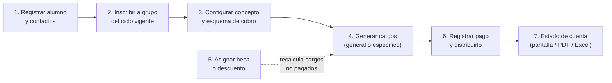
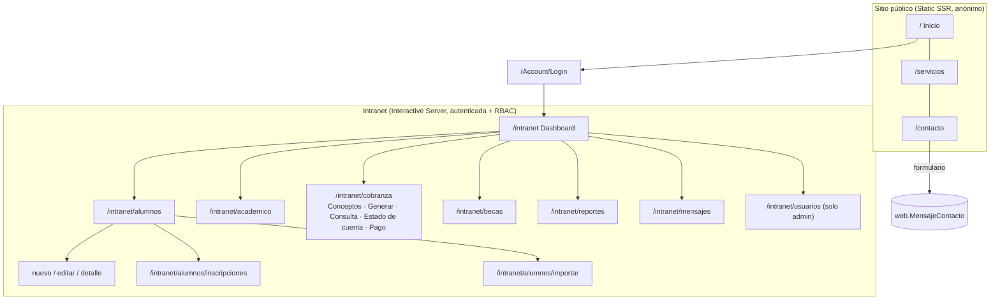
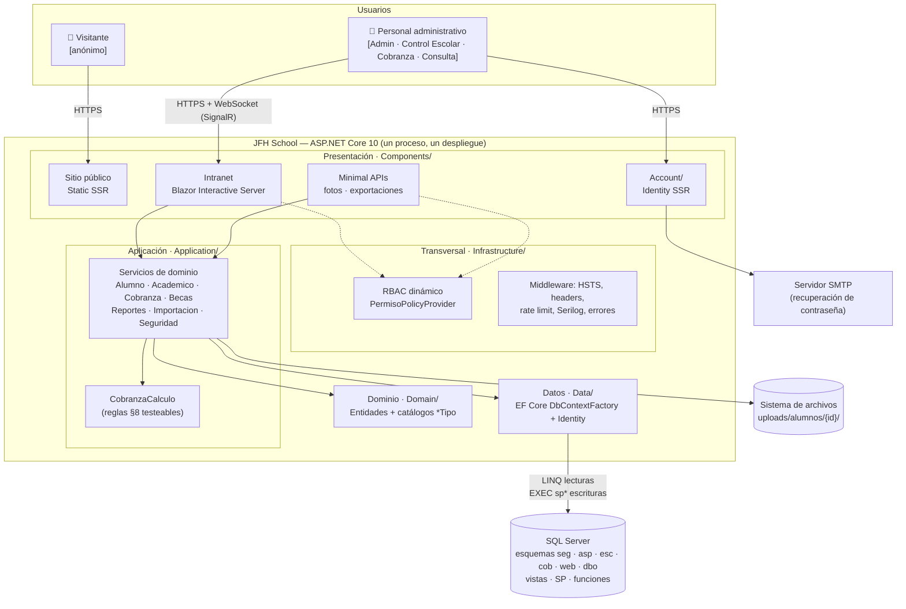
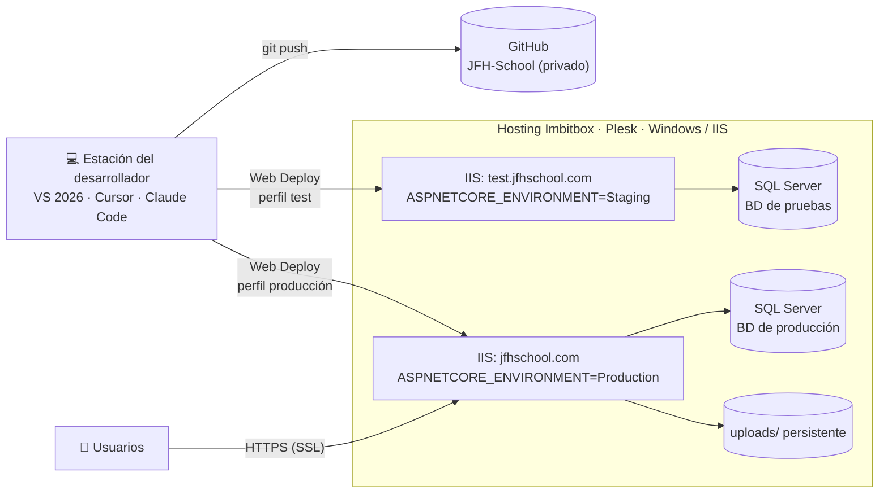

## Índice

0. [Ficha del proyecto](#0-ficha-del-proyecto)
1. [Descripción general del producto](#1-descripción-general-del-producto)
2. [Arquitectura del sistema](#2-arquitectura-del-sistema)
3. [Modelo de datos](#3-modelo-de-datos)
4. [Especificación de la API](#4-especificación-de-la-api)
5. [Historias de usuario](#5-historias-de-usuario)
6. [Tickets de trabajo](#6-tickets-de-trabajo)
7. [Pull requests](#7-pull-requests)

> **Mapa de la documentación de esta entrega**
>
> | Documento | Contenido |
> |-----------|-----------|
> | `readme.md` (este archivo) | Ficha, producto, arquitectura, modelo de datos, API, 3 historias y 3 tickets principales |
> | [`prompts.md`](prompts.md) | Registro del uso de IA: herramientas, modelos, skills, MCP, prompts e intervención humana |
> | [`docs/backlog/historias-de-usuario.md`](docs/backlog/historias-de-usuario.md) | Backlog completo del MVP: 5 historias *must-have* + 2 *should-have* (INVEST + Gherkin) |
> | [`docs/backlog/tickets.md`](docs/backlog/tickets.md) | Desglose en tickets con estimación Fibonacci, DoD por tipo y plan de Entregas 2–3 |
> | [`docs/adr/`](docs/adr/) | Decisiones de arquitectura en formato MADR |
> | [`docs/architecture/workspace.dsl`](docs/architecture/workspace.dsl) | Modelo C4 (Structurizr DSL): contexto, contenedores y componentes |
> | [`docs/api/openapi.yaml`](docs/api/openapi.yaml) | Especificación OpenAPI 3.0 de los endpoints HTTP |
> | [`llms.txt`](llms.txt) | Índice del proyecto para agentes de IA |

---

## 0. Ficha del proyecto

### **0.1. Tu nombre completo:**

Guillermo Alvarez

### **0.2. Nombre del proyecto:**

**JFH School** — ERP web de administración escolar y cobranza para el colegio *Jean Frederic Herbart* (Preescolar y Primaria, Guadalajara, Jalisco).

### **0.3. Descripción breve del proyecto:**

JFH School sustituye la cobranza manual de un colegio privado por un sistema web. El personal administrativo registra alumnos y los inscribe a grupos. Después configura cuánto cuesta cada concepto: un monto fijo o un monto que cambia según la fecha de pago (pronto pago, pago normal, recargo). El sistema genera los cargos de todo el colegio en una sola operación, aplica becas y descuentos, registra pagos parciales o totales y muestra el estado de cuenta de cada alumno al momento.

Incluye además un sitio público comercial, control de acceso por roles y permisos configurables (RBAC), reportes en Excel/PDF, importación masiva de alumnos por Excel y bitácora de auditoría.

**Stack:** .NET 10 · ASP.NET Core 10 · Blazor Web App (Static SSR + Interactive Server) · EF Core 10 · SQL Server · ASP.NET Core Identity · Serilog · ClosedXML · QuestPDF · xUnit.

### **0.4. URL del proyecto:**

| Ambiente | URL | Acceso |
|----------|-----|--------|
| Producción | <https://jfhschool.com> | Sitio público abierto; intranet en `/intranet` con usuario y contraseña |
| Pruebas (Staging) | <https://test.jfhschool.com> | Mismo esquema; base de datos de pruebas |

> Las credenciales de un usuario de prueba con rol *Consulta* se comparten con el equipo evaluador por [onetimesecret](https://onetimesecret.com/), nunca en el repositorio.

### 0.5. URL o archivo comprimido del repositorio

- **Repositorio de código (privado):** <https://github.com/MemoAlvarez86/JFH-School>. Se da acceso de lectura al TA asignado (Opción A del Proyecto Final: repositorio privado).
- **Repositorio de entrega (este fork):** <https://github.com/MemoAlvarez86/AI4Devs-finalproject-GFAM>, rama `feature/entrega-1-GFAM`.

> **Nota sobre el punto de partida (proyecto *brownfield*).** JFH School es un proyecto existente que ya está en producción. Se construyó desde julio de 2026 con asistentes de IA en todas las fases (ver [`prompts.md`](prompts.md)). El MVP que se documenta aquí es el **flujo de cobranza de punta a punta**, ya implementado. Las Entregas 2 y 3 se enfocan en integrar el código en este repositorio y completar lo que aún falta para cumplir la rúbrica: tests de integración, un test end-to-end del flujo principal, pipeline de CI y evidencia de despliegue ([plan en tickets](docs/backlog/tickets.md#4-plan-de-entregas-2-y-3)).

---

## 1. Descripción general del producto

### **1.1. Objetivo:**

**Problema.** En el colegio, la cobranza se lleva a mano. Cada mes hay que calcular la colegiatura de cada alumno según la fecha en que paga (pronto pago, normal o con recargo), restar becas y descuentos, registrar abonos parciales y responder "¿cuánto debo?" a cada familia. El proceso es lento, depende de hojas de cálculo y no deja rastro de quién cambió qué.

**Solución.** Un ERP web que concentra en una sola base de datos el expediente del alumno, la estructura académica (ciclos, secciones, grados, grupos) y la cobranza. Las reglas de negocio (montos por fecha, becas, saldos, estatus) se aplican de forma automática y consistente.

**Para quién.**

| Usuario | Rol en el sistema | Qué obtiene |
|---------|-------------------|-------------|
| Dirección | Administrador | Visión global (dashboard), gestión de usuarios y permisos, autorización de becas |
| Control Escolar | Control Escolar | Expedientes, contactos, inscripciones e importación masiva |
| Caja / Cobranza | Cobranza | Conceptos y esquemas de cobro, generación de cargos, registro de pagos, estados de cuenta y reportes de deudores |
| Personal de consulta | Consulta | Lectura de toda la información sin poder modificarla |
| Familias (indirecto) | — | Estado de cuenta claro y exportable en PDF. El portal de padres queda para una fase futura |
| Visitantes | Anónimo | Sitio comercial con oferta educativa, dos planteles y formulario de contacto |

**Valor que aporta.**

1. **Una sola operación para cobrar a todo el colegio:** los cargos se generan por ámbito (colegio, sección, grado o grupo) y el sistema evita duplicados.
2. **Reglas de monto por fecha:** el mismo mecanismo cubre pronto pago y recargo, sin cálculos a mano.
3. **Becas aplicadas siempre igual:** al asignar o cambiar una beca, se recalculan los cargos que aún no tienen pagos.
4. **Estado de cuenta inmediato**, exportable a PDF o Excel.
5. **Trazabilidad:** auditoría en cada registro y bitácora de acciones sensibles (cancelaciones, becas, usuarios, permisos).

#### Alcance del MVP (flujo principal)



| Prioridad | Historia | Estado |
|-----------|----------|--------|
| **Must** | HU-01 Registrar expediente de alumno con contactos | ✅ Implementada |
| **Must** | HU-02 Inscribir alumnos a un grupo del ciclo vigente | ✅ Implementada |
| **Must** | HU-03 Generar cargos a partir de un esquema de cobro | ✅ Implementada |
| **Must** | HU-04 Registrar un pago y consultar el estado de cuenta | ✅ Implementada |
| **Must** | HU-05 Asignar beca o descuento con recálculo automático | ✅ Implementada |
| Should | HU-06 Importar alumnos desde Excel con vista previa | ✅ Implementada |
| Should | HU-07 Dashboard de cobranza y reportes exportables | ✅ Implementada |
| Won't (fase futura) | Portal de padres, pago electrónico bancario, CFDI, módulo académico (calificaciones), app móvil | Fuera de alcance |

El detalle de cada historia está en [`docs/backlog/historias-de-usuario.md`](docs/backlog/historias-de-usuario.md).

### **1.2. Características y funcionalidades principales:**

| # | Módulo | Funcionalidades | MVP |
|---|--------|-----------------|-----|
| 1 | **Alumnos** | Listado con búsqueda (nombre, CURP, matrícula), filtros y paginación. Alta y edición con validación estructural de CURP y CURP única. Contactos con roles (tutor, emergencia, responsable de pago), alta rápida de parentesco. Expediente con fotografía | ✅ |
| 2 | **Inscripciones** | Inscripción individual o masiva a un grupo. Valida cupo, que el ciclo no esté cerrado, que el grupo pertenezca al ciclo y que el alumno no tenga otra inscripción activa. El ciclo vigente se selecciona por defecto | ✅ |
| 3 | **Estructura académica** | CRUD de ciclos escolares (Planeado / Vigente / Cerrado), secciones, grados y grupos con clave visible (`1°A`) y cupo | ✅ |
| 4 | **Conceptos y esquemas de cobro** | Conceptos únicos o recurrentes. Esquema por ciclo con monto **fijo** o **variable por fecha** (escalones con fecha de corte) | ✅ |
| 5 | **Generación de cargos** | General (por colegio, sección, grado o grupo) o específica (alumnos seleccionados). Vista previa, periodo `AAAA-MM`, descripción libre. Idempotente: no duplica (alumno, concepto, ciclo, periodo) | ✅ |
| 6 | **Pagos** | Registro manual con método de pago, referencia y autorización. Un pago se reparte entre varios cargos (a mano o de forma automática). Se aceptan abonos parciales. Saldos y estatus se recalculan en una transacción | ✅ |
| 7 | **Estado de cuenta** | Cargos, pagos aplicados y saldo por alumno y ciclo. Cancelación de cargos sin pagos, con bitácora. Recálculo manual de montos | ✅ |
| 8 | **Becas y descuentos** | Beca 100 %, descuento porcentual o de monto fijo, para un concepto o para todos. Vigencia por fechas. Un beneficio activo por (alumno, ciclo, concepto). Recálculo automático de cargos no pagados | ✅ |
| 9 | **Importación Excel** | Plantilla con 2 filas de ejemplo, validación por fila (CURP, catálogos, fechas, teléfonos) con vista previa de errores y confirmación transaccional. Límites de 2 000 filas y 5 MB | Should |
| 10 | **Dashboard y reportes** | KPIs del ciclo vigente (facturado, cobrado, pendiente, vencido). Reportes de estado de cuenta, pagos por periodo, deudores y becados, exportables a Excel y PDF | Should |
| 11 | **Usuarios, roles y permisos** | Matriz de permisos por rol y módulo (Ver / Crear / Editar / Eliminar). Solo un administrador gestiona la sección. Protección del último administrador. Sin registro público | Transversal |
| 12 | **Mensajes de contacto** | Bandeja de mensajes del sitio público con estatus pendiente/atendido; al atender se exige registrar la acción realizada. Campana de notificaciones | — |
| 13 | **Sitio público** | Home, oferta educativa por plantel (Preescolar / Primaria), instalaciones, galería, proceso de admisión, contacto con dos mapas y formulario con límite de envíos | — |
| 14 | **Transversales** | Bitácora (`dbo.Bitacora`), soft-delete global, hora local de México (`Reloj.Ahora` / `dbo.fnAhora()`), cultura `es-MX`, logging con Serilog, página de error amigable | ✅ |

### **1.3. Diseño y experiencia de usuario:**

> Las capturas de pantalla y el video del recorrido completo se añaden en la Entrega 3 (evidencia de funcionamiento). Esta sección describe el diseño que se documentó y aplicó.

**Identidad visual** (`docs/BRANDBOOK.md` del repositorio de código):

| Token | Valor | Uso |
|-------|-------|-----|
| Azul institucional | `#242F9B` | Color primario, navegación, botones principales |
| Verde | `#01C607` | Acciones de éxito y confirmación |
| Dorado | `#DABA4B` | Acentos y monograma "H" |
| Tipografía | Inter (texto) + Playfair Display (títulos del sitio público) | — |
| Iconografía | Bootstrap Icons 1.11 | — |

**Mapa de navegación:**



**Patrones de experiencia aplicados** (normados en `docs/EstructuraProyecto.md` §12):

- **Menú según permisos:** cada usuario solo ve los módulos que su rol puede *Ver*, y los botones Crear/Editar/Eliminar aparecen solo si el rol tiene ese permiso.
- **Formularios por pasos:** en el expediente se capturan primero los datos del alumno y después las tarjetas de contacto, que se agregan una por una y muestran si están "Guardado" o "Sin guardar".
- **Operaciones masivas con confirmación:** generar cargos, inscribir alumnos e importar Excel siguen el orden *destino → selección → vista previa/resumen → confirmar*.
- **Barra de acciones fija** en formularios largos: a la izquierda el estado (error, éxito o resumen) y a la derecha los botones.
- **El ciclo vigente se preselecciona** en todos los combos de ciclo escolar.
- **Accesibilidad:** `aria-label` y `title` en botones de solo icono; áreas táctiles de 44 px en switches; foco visible; estados de "Cargando…" y "Sin resultados" siempre visibles.
- **Idioma y formato:** español de México, moneda MXN, fechas `dd/MM/yyyy`, teléfonos con máscara `99-9999-9999`.

### **1.4. Instrucciones de instalación:**

**Requisitos previos**

| Herramienta | Versión |
|-------------|---------|
| .NET SDK | 10.0 |
| SQL Server | 2019 o superior (o Azure SQL / SQL Server en Docker) |
| `sqlcmd` | Cualquier versión reciente |
| `dotnet-ef` | 10.x (`dotnet tool install --global dotnet-ef`) |

**1. Clonar el repositorio**

```bash
git clone https://github.com/MemoAlvarez86/JFH-School.git
cd "JFH-School"
```

**2. Crear la base de datos y los objetos de negocio (scripts-first)**

El esquema de negocio (`esc`, `cob`, `web`, `dbo`, `seg.Modulo/Permiso`) se crea con scripts SQL versionados, no con migraciones de EF.

```bash
sqlcmd -S localhost -E -Q "CREATE DATABASE jfhschool_dev COLLATE SQL_Latin1_General_CP1_CI_AS"
cd db
sqlcmd -S localhost -E -d jfhschool_dev -I -i 00_MASTER_deploy.sql
cd ..
```

El script maestro usa includes `:r .\…` relativos, por eso se ejecuta desde la carpeta `db/`. Aplica en orden: esquemas → `dbo.fnAhora()` → catálogos → tablas `seg`/`web`/`esc`/`cob` → bitácora → seeds → funciones → vistas → procedimientos.

**3. Configurar la cadena de conexión** (fuera del control de versiones)

```bash
dotnet user-secrets set "ConnectionStrings:DefaultConnection" "Server=localhost;Database=jfhschool_dev;Trusted_Connection=True;TrustServerCertificate=True"
```

**4. Aplicar las migraciones de Identity** (tablas `seg.Usuario`, `seg.Rol`, `seg.UsuarioRol` y satélites en `asp`)

```bash
dotnet ef database update --project "JFH School.csproj"
```

**5. Ejecutar**

```bash
dotnet run --project "JFH School.csproj" --launch-profile http
```

Al arrancar, la aplicación siembra los roles (Administrador, Control Escolar, Cobranza, Consulta), los módulos, la matriz base de permisos y el usuario `admin`. La contraseña inicial está en el seed de `Program.cs`; se cambia en el primer acceso desde *Perfil*.

- Sitio público: <http://localhost:5058>
- Intranet: <http://localhost:5058/intranet>

**6. Verificar el despliegue de BD y ejecutar las pruebas**

```bash
sqlcmd -S localhost -E -d jfhschool_dev -i db/verificacion/01_auditoria_despliegue.sql
dotnet test tests/JFH_School.UnitTests
```

La auditoría debe devolver `TotalPendientes = 0`.

**Datos de prueba:** la plantilla de importación (`/intranet/alumnos/importar` → *Descargar plantilla*) trae dos alumnos de ejemplo completos. Con ellos se puede recorrer el flujo principal completo: importar → inscribir → configurar esquema → generar cargos → pagar.

---

## 2. Arquitectura del Sistema

### **2.1. Diagrama de arquitectura:**



El modelo C4 formal (contexto, contenedores y componentes) está en [`docs/architecture/workspace.dsl`](docs/architecture/workspace.dsl).

**Patrón: monolito modular en capas.** Es una sola aplicación ASP.NET Core con capas separadas por carpetas y namespaces (`Components → Application → Domain`, con `Data` e `Infrastructure` como soporte) y módulos verticales por dominio (Alumnos, Académico, Cobranza, Becas…). La lógica de escritura crítica vive en **procedimientos almacenados** y el esquema de negocio se gestiona **scripts-first**.

**Por qué esta arquitectura** (decisiones registradas en [`docs/adr/`](docs/adr/)):

| Decisión | Motivo | ADR |
|----------|--------|-----|
| Monolito modular en un solo proyecto | Una sola institución, equipo de 1–2 personas y hosting compartido con IIS. Un despliegue simple pesa más que la escalabilidad independiente | [ADR-0001](docs/adr/20260723-monolito-modular-blazor-interactive-server.md) |
| Blazor Interactive Server en intranet y Static SSR en sitio público | La lógica y las credenciales no salen al cliente, el acceso a servicios es directo y el sitio comercial es rápido y bueno para SEO | [ADR-0001](docs/adr/20260723-monolito-modular-blazor-interactive-server.md) |
| Scripts SQL versionados + SP para escrituras | Se cumple el Estándar de BD del proveedor, las reglas de cobranza son transaccionales en el motor y los scripts son revisables | [ADR-0002](docs/adr/20260723-scripts-first-y-procedimientos-almacenados.md) |
| RBAC con policies dinámicas | Los permisos se configuran desde la UI sin redeploy y la autorización se revalida en servidor | [ADR-0003](docs/adr/20260807-rbac-policies-dinamicas.md) |
| Spec-Driven Development con OpenSpec | Los cambios medianos se especifican antes de implementar con agentes de IA | [ADR-0004](docs/adr/20260909-spec-driven-development-openspec.md) |

**Beneficios**

- Un solo artefacto que desplegar (Web Deploy a IIS), sin coordinar versiones entre servicios.
- Llamadas en proceso: la UI invoca servicios de aplicación sin una API REST intermedia, lo que ahorra código y latencia.
- Integridad transaccional de la cobranza en el motor (`SET XACT_ABORT ON`, índices únicos filtrados como garantía de idempotencia).
- Superficie de ataque reducida: Interactive Server no expone lógica de negocio en el navegador.
- Reglas de arquitectura escritas (`docs/EstructuraProyecto.md`) que los agentes de IA leen como contexto.

**Sacrificios y deudas asumidas**

| Sacrificio | Mitigación |
|------------|------------|
| Interactive Server mantiene un circuito SignalR por usuario: escalar horizontalmente requiere sesiones persistentes o un backplane | Una instancia alcanza para una institución (cientos a miles de alumnos). Backplane Redis o WebAssembly como opción futura |
| Las capas son carpetas, no proyectos: nada en compilación impide que la UI use el `DbContext` | Regla de oro documentada, reglas de Cursor siempre activas, checklist §17 y revisión humana |
| Reglas de cobranza en SQL (funciones/SP), más difíciles de probar con tests unitarios | Espejo en C# (`CobranzaCalculo.cs`) con 14 pruebas unitarias. Los tests de integración contra SQL Server están planificados para la Entrega 3 |
| Dos fuentes de esquema: scripts SQL (negocio) y migraciones EF (Identity) | Límites documentados y script de auditoría de despliegue idempotente |
| Sin API pública REST | No hace falta en esta fase. El portal de padres futuro reutilizará los servicios de aplicación |

### **2.2. Descripción de componentes principales:**

| Componente | Tecnología | Responsabilidad |
|------------|------------|-----------------|
| **Sitio público** | Blazor Static SSR, CSS propio, JS mínimo (`site.js`) | Presencia comercial: oferta por plantel, instalaciones, admisión y contacto. Sin sesión |
| **Intranet** | Blazor Interactive Server (SignalR) | Pantallas de los módulos administrativos. Solo inyecta servicios de `Application` y trabaja con DTOs |
| **Account** | ASP.NET Core Identity (SSR) | Login, bloqueo tras intentos fallidos, recuperación de contraseña por correo, 2FA opcional. Registro público deshabilitado |
| **Minimal APIs** | ASP.NET Core Endpoints | Descarga de fotografías protegidas y exportación de reportes (Excel/PDF), con `RequireAuthorization` por permiso |
| **Servicios de aplicación** | C# 14, heredan de `ServicioBase` | Casos de uso, validación de negocio y orquestación. Devuelven `Resultado<T>` en lugar de lanzar excepciones esperables. Revalidan permisos (defensa en profundidad) |
| **`ServicioBase`** | `IDbContextFactory<ApplicationDbContext>` | Contexto de vida corta por operación. Traduce `RAISERROR` de los SP a mensajes de negocio y registra fallos técnicos |
| **`CobranzaCalculo`** | C# puro | Espejo testeable de las reglas §8.1–§8.4 (monto por fecha, descuentos, saldo, estatus) |
| **Dominio** | Entidades POCO | Entidades alineadas al diccionario de datos: auditoría de 6 campos y `EsEliminado` |
| **Datos** | EF Core 10 SQL Server | Mapeo a esquemas, filtro global de soft-delete, Identity con stores propios (`JfhUserStore`, `JfhRoleStore`) |
| **RBAC** | `IAuthorizationPolicyProvider` + `AuthorizationHandler` | Policy `Permiso:{modulo}:{accion}` resuelta contra `seg.Permiso`. `EsAdmin` da acceso total |
| **Base de datos** | SQL Server | 6 esquemas, vistas `vs*`, procedimientos `sp*`, funciones `fn*`. Reglas de cobranza transaccionales |
| **Exportaciones** | ClosedXML, QuestPDF | Reportes Excel y estado de cuenta en PDF con la marca del colegio |
| **Observabilidad** | Serilog | Consola + archivo rotativo diario (14 días), request logging, `JfhErrorBoundary` en Blazor |
| **Correo** | MailKit | Envío SMTP de recuperación de contraseña con plantilla HTML |

### **2.3. Descripción de alto nivel del proyecto y estructura de ficheros**

```text
JFH-School/
├── Program.cs                  # Composición: DI, Identity, RBAC, rate limiting, Serilog, pipeline, seeds
├── appsettings*.json           # Configuración por ambiente (Development / Staging / Production)
├── Components/                 # PRESENTACIÓN (Blazor)
│   ├── Layout/                 #   Layouts público, principal y reconexión
│   ├── Pages/ + Pages/Public/  #   Sitio comercial (Static SSR) y sus secciones reutilizables
│   ├── Account/                #   Identity: login, recuperación, 2FA, gestión de cuenta
│   ├── Intranet/{Modulo}/      #   Index / Formulario / Detalle por módulo + IntranetLayout
│   └── Shared/                 #   InputTelefono, InputPeriodo, JfhErrorBoundary
├── Application/                # APLICACIÓN
│   ├── Services/               #   *Service : ServicioBase (un servicio por dominio)
│   ├── DTOs/{Dominio}/         #   ListadoDto, FormDto, FiltroDto
│   ├── Cobranza/               #   CobranzaCalculo (reglas puras testeables)
│   └── Importacion/            #   Validador y plantilla de Excel (reglas puras)
├── Domain/                     # DOMINIO
│   ├── Entities/{Escolar|Cobranza|Seguridad|Web}/
│   └── Catalogos/{Escolar|Cobranza|Comun}/
├── Data/                       # DATOS: ApplicationDbContext, Identity (int), Migrations (solo seg/asp)
├── Infrastructure/             # TRANSVERSAL: Authorization/, Endpoints/, Email/, Security/, Reloj, CurrentUser
├── Shared/                     # Resultado<T>, ModuloClaves, helpers (CURP, teléfono, ciclo, periodo), contenido público
├── db/                         # FUENTE DE VERDAD DEL ESQUEMA DE NEGOCIO (scripts-first)
│   ├── 00_MASTER_deploy.sql
│   ├── esquemas/ tablas/ catalogos/ funciones/ vistas/ procedimientos/
│   ├── alteraciones/           #   Cambios fechados YYYY-MM-DD_descripcion.sql (idempotentes)
│   └── verificacion/           #   Auditoría de despliegue
├── docs/                       # "CONSTITUCIÓN": documento técnico, estructura, estándar BD, diccionario, roadmap, brandbook
├── openspec/                   # SDD: config.yaml, specs/ vigentes, changes/ activos y archivados
├── .cursor/                    # Reglas, skills y slash commands para agentes de IA
├── tests/JFH_School.UnitTests/ # xUnit + FluentAssertions
└── wwwroot/                    # CSS del design system, JS, imágenes
```

El proyecto sigue una **arquitectura en capas inspirada en Clean Architecture**, adaptada a un solo proyecto. Las dependencias apuntan hacia el dominio y la regla de oro es que **la UI nunca usa `ApplicationDbContext`**. `docs/` actúa como constitución del proyecto y `openspec/` guarda los deltas de cada cambio; ambos son contexto obligatorio para los agentes de IA.

### **2.4. Infraestructura y despliegue**



| Ambiente | Dominio | Configuración | Uso |
|----------|---------|---------------|-----|
| Development | `localhost:5058` | `appsettings.Development.json` + user-secrets | Desarrollo local |
| Staging | `test.jfhschool.com` | `appsettings.Staging.json` | Validación del cliente (UAT) |
| Production | `jfhschool.com` | `appsettings.Production.json` | Operación real |

**Proceso de despliegue**

1. **Base de datos primero.** Los cambios de esquema se escriben como script idempotente en `db/alteraciones/YYYY-MM-DD_*.sql`, se aplican en Staging, se verifican con `db/verificacion/01_auditoria_despliegue.sql` (`TotalPendientes = 0`) y después pasan a producción. Si cambia una función, se redesplegan los SP que dependen de ella, porque SQL Server resuelve los nombres hasta la ejecución.
2. **Aplicación.** Se publica desde Visual Studio con el perfil Web Deploy (`Properties/PublishProfiles/*.pubxml`). MSBuild sustituye `ASPNETCORE_ENVIRONMENT` en `web.config` según el perfil.
3. **Verificación.** Smoke test manual del flujo principal en Staging y luego en producción. Serilog registra el arranque y los seeds.

**Pendiente (planificado para las Entregas 2–3):** pipeline de CI en GitHub Actions (build + tests en cada PR) y backups automáticos de SQL Server en el hosting.

### **2.5. Seguridad**

| Práctica | Implementación | Ejemplo |
|----------|----------------|---------|
| **Autenticación robusta** | ASP.NET Core Identity con hash PBKDF2, cookie `JFHSchool.Auth` `HttpOnly`/`Secure` | Contraseña de mínimo 8 caracteres con mayúscula y dígito |
| **Bloqueo tras intentos fallidos** | `Lockout` de Identity | 5 intentos → bloqueo de 15 min |
| **Sin registro público** | `/Account/Register` redirige al login | Solo un administrador crea cuentas desde `/intranet/usuarios` |
| **RBAC por módulo y acción** | Policies dinámicas `Permiso:{modulo}:{accion}` | `[AuthorizePermiso(ModuloClaves.Cobranza, PermisoAcciones.Ver)]` en la página |
| **Defensa en profundidad** | Los servicios revalidan el permiso aunque la UI oculte el botón | `CobranzaService.InsertarPagoAsync` devuelve `Falla` si el rol no tiene *Crear* |
| **Protección del último administrador** | `SeguridadService` | No se puede eliminar, bloquear ni quitar el rol al único admin vigente |
| **Endpoints protegidos** | `RequireAuthorization(policy)` en Minimal APIs | Las fotos de alumnos (menores de edad) se sirven solo con permiso *Alumnos/Ver*, nunca desde `wwwroot` |
| **Validación de archivos** | `AlumnoFotoService`, `ImportacionService` | Solo JPG/PNG de hasta 2 MB. Excel de hasta 5 MB y 2 000 filas |
| **Inyección SQL** | Escrituras por SP con `SqlParameter`, lecturas con LINQ parametrizado | No hay SQL concatenado en la aplicación |
| **HTTPS y cabeceras** | `UseHsts()` fuera de Development + `SecurityHeadersMiddleware` | `X-Frame-Options`, `X-Content-Type-Options`, `Referrer-Policy` |
| **Antiforgery** | `UseAntiforgery()` | Todos los formularios SSR |
| **Anti-spam** | `AddRateLimiter` política `contacto-publico` | 5 envíos cada 15 min por IP en el formulario público |
| **Auditoría y trazabilidad** | 6 campos de auditoría + `dbo.Bitacora` | `CANCELAR_CARGO`, `INSERTAR/ACTUALIZAR/ELIMINAR_BENEFICIO`, cambios de usuarios, roles y permisos |
| **Soft-delete** | `EsEliminado` + `HasQueryFilter` | No hay `DELETE` físico en flujos normales y el historial se conserva |
| **Errores sin fuga de información** | `UseExceptionHandler("/error")`, `JfhErrorBoundary`, `ServicioBase` | El usuario ve un mensaje en español y el detalle técnico queda solo en el log |
| **Datos personales (LFPDPPP)** | Acceso por permisos, cifrado en tránsito | CURP y datos de menores visibles solo para roles autorizados |

```csharp
// Infrastructure/Endpoints/ReportesEndpoints.cs — autorización por permiso en un endpoint
grupo.MapGet("/estado-cuenta/{alumnoId:int}", async (int alumnoId, ReportesService svc,
        int? cicloEscolarId, string? format) => { /* … */ })
    .RequireAuthorization(PermisoPolicyProvider.Nombre(ModuloClaves.Reportes, PermisoAcciones.Ver));
```

**Deuda de seguridad identificada** (ticket [TK-SEC-01](docs/backlog/tickets.md#tk-sec-01)): los secretos (cadena SQL, SMTP) viven en `appsettings.{Environment}.json` por una decisión operativa del hosting, y el seed del administrador tiene una contraseña inicial en código. El plan es moverlos a variables de entorno o user-secrets y forzar el cambio de contraseña en el primer acceso.

### **2.6. Tests**

**Estado actual:** proyecto `tests/JFH_School.UnitTests` con xUnit + FluentAssertions, **29 métodos de prueba** en 4 clases. Se priorizaron las reglas donde un error cuesta dinero o genera datos inválidos.

| Clase | Pruebas | Qué garantiza |
|-------|---------|---------------|
| `CobranzaCalculoTests` | 14 | Reglas §8.1–§8.4: monto fijo; escalones de pronto pago, normal y recargo tras el último corte; beca 100 %; descuento porcentual; descuento fijo que no supera la base; el beneficio específico gana al general; vigencia; saldo; monto final nunca negativo; estatus Pagado/Pendiente/Vencido/Cancelado |
| `ImportacionAlumnoValidadorTests` | 9 | Validación por fila del Excel: CURP, catálogos, fechas en 3 formatos, sexo, teléfono, parentesco inexistente |
| `ImportacionPlantillaEjemplosTests` | 3 | Las filas de ejemplo de la plantilla pasan la validación (la plantilla no puede contradecir al validador) |
| `CurpHelperTests` | 3 | Estructura de CURP de 18 posiciones (casos válidos e inválidos) |

```csharp
[Fact]
public void CalcularMontoCargo_Variable_RecargoTrasUltimoCorte()
{
    // Escalones: 05-sep $2,300 · 10-sep $2,500 · 30-sep $2,700
    // Pago el 02-oct (después del último corte) ⇒ aplica el último escalón (recargo)
}
```

**Estrategia para la Entrega 3** (pirámide de pruebas, ver [tickets QA](docs/backlog/tickets.md#4-plan-de-entregas-2-y-3)):

| Nivel | Herramienta | Alcance planificado |
|-------|-------------|---------------------|
| Unitarias | xUnit + FluentAssertions | Mantener y ampliar a validadores de becas y pagos |
| Integración | `WebApplicationFactory` + SQL Server en contenedor (Testcontainers) con `00_MASTER_deploy.sql` | `cob.spGenerarCargo` (idempotencia, beca 100 %), `cob.spInsertarPago` (distribución, rechazo de cargo ajeno), policies RBAC |
| Componentes | bUnit | Formulario de pago y validaciones en línea |
| End-to-end | Playwright (.NET) | Flujo principal: login → generar cargo → registrar pago → estado de cuenta con saldo 0 |

---

## 3. Modelo de Datos

### **3.1. Diagrama del modelo de datos:**

Se muestran las entidades del flujo principal con sus claves. **Toda tabla** incluye además los 6 campos de auditoría (`FechaCreacion`, `CreadoPor`, `UsuarioCreacionID`, `FechaModificacion`, `ModificadoPor`, `UsuarioModificacionID`) y la bandera `EsEliminado BIT NOT NULL DEFAULT 0` (soft-delete). Se omiten en el diagrama para que sea legible.

```mermaid
erDiagram
    EstatusAlumnoTipo ||--o{ Alumno : "clasifica"
    Estado ||--o{ Alumno : "domicilio en"
    Alumno ||--o{ AlumnoContacto : "tiene"
    ParentescoTipo ||--o{ AlumnoContacto : "clasifica"
    Seccion ||--o{ Grado : "agrupa"
    Grado ||--o{ Grupo : "se abre en"
    CicloEscolar ||--o{ Grupo : "contiene"
    EstatusCicloTipo ||--o{ CicloEscolar : "clasifica"
    Alumno ||--o{ Inscripcion : "se inscribe"
    Grupo ||--o{ Inscripcion : "recibe"
    CicloEscolar ||--o{ Inscripcion : "periodo de"
    ConceptoCargoTipo ||--o{ ConceptoCargo : "clasifica"
    ConceptoCargo ||--o{ EsquemaCobro : "se cobra con"
    CicloEscolar ||--o{ EsquemaCobro : "vigente en"
    EsquemaMontoTipo ||--o{ EsquemaCobro : "fijo o variable"
    EsquemaCobro ||--o{ EscalonMonto : "escalones por fecha"
    Alumno ||--o{ Cargo : "adeuda"
    ConceptoCargo ||--o{ Cargo : "por concepto"
    CicloEscolar ||--o{ Cargo : "del ciclo"
    EstatusCargoTipo ||--o{ Cargo : "estatus"
    OrigenCargoTipo ||--o{ Cargo : "origen"
    Alumno ||--o{ Pago : "realiza"
    MetodoPagoTipo ||--o{ Pago : "método"
    Pago ||--|{ PagoCargo : "se distribuye en"
    Cargo ||--o{ PagoCargo : "recibe abonos"
    Alumno ||--o{ Beneficio : "goza de"
    BeneficioTipo ||--o{ Beneficio : "tipo"
    CicloEscolar ||--o{ Beneficio : "vigente en"
    ConceptoCargo |o--o{ Beneficio : "aplica a (NULL = todos)"
    Usuario }o--o{ Rol : "UsuarioRol"
    Rol ||--o{ Permiso : "tiene"
    Modulo ||--o{ Permiso : "sobre"

    Alumno {
        int AlumnoID PK
        char(18) Curp UK "única, validada"
        nvarchar(20) Matricula UK "única filtrada (no nula)"
        nvarchar(80) Nombres
        nvarchar(60) Paterno
        nvarchar(60) Materno "nullable"
        date FechaNacimiento
        char(1) Sexo "CK H o M"
        nvarchar(300) FotografiaUrl "endpoint autorizado"
        date FechaIngreso
        int EstatusAlumnoTipoID FK
        int EstadoID FK "nullable"
        nvarchar(120) Calle
        nvarchar(20) NumeroExterior
        nvarchar(20) NumeroInterior
        nvarchar(80) Colonia
        char(5) CodigoPostal
        nvarchar(80) Municipio
    }
    AlumnoContacto {
        int AlumnoContactoID PK
        int AlumnoID FK
        nvarchar(80) Nombres
        nvarchar(60) Paterno
        int ParentescoTipoID FK
        nvarchar(20) Telefono "99-9999-9999"
        nvarchar(120) Correo
        bit EsTutor "default 1"
        bit EsContactoEmergencia "default 0"
        bit EsResponsablePago "máx. 1 por alumno"
    }
    CicloEscolar {
        int CicloEscolarID PK
        nvarchar(20) Clave UK "2026-2027"
        nvarchar(60) CicloEscolar
        date FechaInicio
        date FechaFin
        int EstatusCicloTipoID FK "Planeado, Vigente, Cerrado"
    }
    Seccion {
        int SeccionID PK
        nvarchar(60) Seccion UK "Preescolar, Primaria"
    }
    Grado {
        int GradoID PK
        int SeccionID FK
        nvarchar(20) Grado
        int Orden
    }
    Grupo {
        int GrupoID PK
        int GradoID FK
        int CicloEscolarID FK
        nvarchar(20) Grupo "UI con Grado+Ciclo"
        nvarchar(30) Clave "UI con Ciclo, ej. 1°A"
        int Cupo
    }
    Inscripcion {
        int InscripcionID PK
        int AlumnoID FK "UI activa por Alumno+Ciclo"
        int GrupoID FK
        int CicloEscolarID FK
        date FechaInscripcion
        int EstatusInscripcionTipoID FK "Activa, Baja"
    }
    ConceptoCargo {
        int ConceptoCargoID PK
        nvarchar(80) ConceptoCargo UK
        nvarchar(200) Descripcion
        int ConceptoCargoTipoID FK "Unico, Recurrente"
    }
    EsquemaCobro {
        int EsquemaCobroID PK
        int ConceptoCargoID FK "UQ con Ciclo"
        int CicloEscolarID FK
        int EsquemaMontoTipoID FK "Fijo, VariablePorFecha"
        decimal MontoFijo "CK obligatorio si Fijo"
    }
    EscalonMonto {
        int EscalonMontoID PK
        int EsquemaCobroID FK
        date FechaCorte
        decimal Monto "CK mayor a 0"
        int Orden
    }
    Cargo {
        int CargoID PK
        int AlumnoID FK "UI Alumno+Concepto+Ciclo+Periodo"
        int ConceptoCargoID FK
        int CicloEscolarID FK
        char(7) Periodo "AAAA-MM"
        nvarchar(200) Descripcion
        decimal MontoBase
        decimal MontoDescuento
        decimal MontoFinal "CK mayor o igual a 0"
        decimal Saldo
        date FechaEmision
        date FechaVencimiento
        int EstatusCargoTipoID FK "Pendiente, Pagado, Vencido, Cancelado"
        int OrigenCargoTipoID FK "General, Especifico"
    }
    Pago {
        int PagoID PK
        int AlumnoID FK
        datetime FechaPago
        decimal MontoTotal "CK mayor a 0"
        int MetodoPagoTipoID FK
        nvarchar(60) Referencia
        nvarchar(50) Autorizacion
    }
    PagoCargo {
        int PagoCargoID PK
        int PagoID FK "UQ con CargoID"
        int CargoID FK
        decimal MontoAplicado "CK mayor a 0"
    }
    Beneficio {
        int BeneficioID PK
        int AlumnoID FK
        int BeneficioTipoID FK "Beca, DescPorcentaje, DescMontoFijo"
        decimal Valor "CK mayor o igual a 0"
        int ConceptoCargoID FK "NULL = todos"
        int CicloEscolarID FK
        date FechaInicio
        date FechaFin
        nvarchar(120) AutorizadoPor
    }
    Usuario {
        int UsuarioID PK
        nvarchar(50) Usuario UK "inmutable"
        nvarchar(100) NombreUsuario
        nvarchar(50) Correo
    }
    Rol {
        int RolID PK
        nvarchar(80) Rol UK
        bit EsAdmin "UI solo uno vigente"
    }
    Modulo {
        int ModuloID PK
        nvarchar(50) Clave UK "alumnos, cobranza"
        nvarchar(80) Modulo
    }
    Permiso {
        int PermisoID PK
        int RolID FK "UI con ModuloID"
        int ModuloID FK
        bit EsVer
        bit EsCrear
        bit EsEditar
        bit EsEliminar "permiso RBAC, no soft-delete"
    }
```



**Tablas de soporte fuera del diagrama:** `web.MensajeContacto`, `web.ConfiguracionEscuela`, `dbo.Bitacora` y las tablas de configuración de Identity en el esquema `asp` (`UsuarioAtributo`, `RolAtributo`, `UsuarioAccesoExterno`, `UsuarioToken`, `UsuarioPasskey`, `HistorialMigracion`).

### **3.2. Descripción de entidades principales:**

**Convenciones** (Estándar de Programación y Nomenclatura de BD v1.2): nombres en español sin acentos, `UpperCamelCase` singular; PK `EntidadID INT IDENTITY(1,1)` con `PK_Tabla CLUSTERED`; FK `EntidadReferenciadaID` con `FK_Origen_Destino`; booleanos con prefijo `Es`/`Tiene`; catálogos terminados en `Tipo`; montos `DECIMAL(18,2)`; fechas `DATE`/`DATETIME` (sin `DATETIME2`); restricciones con nombre explícito (`PK_`, `FK_`, `DF_`, `UQ_`, `CK_`, `I_`, `UI_`). Todo índice único de una tabla con soft-delete filtra `EsEliminado = 0`.

| Esquema | Dominio | Tablas |
|---------|---------|--------|
| `esc` | Escolar | `Alumno`, `AlumnoContacto`, `CicloEscolar`, `Seccion`, `Grado`, `Grupo`, `Inscripcion` + 4 catálogos `*Tipo` |
| `cob` | Cobranza | `ConceptoCargo`, `EsquemaCobro`, `EscalonMonto`, `Cargo`, `Pago`, `PagoCargo`, `Beneficio` + 6 catálogos `*Tipo` |
| `seg` | Seguridad | `Usuario`, `Rol`, `UsuarioRol` (Identity), `Modulo`, `Permiso` |
| `asp` | Configuración del framework | Claims, logins externos, tokens, passkeys, historial EF |
| `web` | Sitio público | `ConfiguracionEscuela`, `MensajeContacto` |
| `dbo` | Común | `Estado`, `Bitacora`, función `fnAhora()` |

#### `esc.Alumno` — expediente del alumno

| Columna | Tipo | Restricciones | Descripción |
|---------|------|---------------|-------------|
| `AlumnoID` | INT IDENTITY | PK `PK_Alumno` | Identificador |
| `Curp` | CHAR(18) | NOT NULL, `UQ_Alumno_Curp` | Validada con regex y estructura en la app |
| `Matricula` | NVARCHAR(20) | NULL, `UI_Alumno_Matricula` (única filtrada) | Asignada por el colegio |
| `Nombres` / `Paterno` / `Materno` | NVARCHAR(80/60/60) | NOT NULL / NOT NULL / NULL | Índice `I_Alumno_Paterno_Materno_Nombres` para búsqueda |
| `FechaNacimiento` | DATE | NOT NULL | — |
| `Sexo` | CHAR(1) | NOT NULL, `CK_Alumno_Sexo IN ('H','M')` | Dos valores fijos: CHECK en lugar de catálogo |
| `FotografiaUrl` | NVARCHAR(300) | NULL | Ruta del endpoint autorizado, no URL pública |
| `FechaIngreso` | DATE | NOT NULL | — |
| `EstatusAlumnoTipoID` | INT | FK → `esc.EstatusAlumnoTipo` | Activo, Inactivo, Egresado |
| `Calle`, `NumeroExterior`, `NumeroInterior`, `Colonia`, `CodigoPostal`, `Municipio` | NVARCHAR / CHAR(5) | NULL | Domicilio |
| `EstadoID` | INT | NULL, FK → `dbo.Estado` | Entidad federativa |
| `Observaciones` | NVARCHAR(500) | NULL | — |

**Relaciones:** 1:N con `AlumnoContacto`, `Inscripcion`, `Cargo`, `Pago` y `Beneficio`.

#### `esc.AlumnoContacto` — contactos con roles

| Columna | Tipo | Restricciones | Descripción |
|---------|------|---------------|-------------|
| `AlumnoContactoID` | INT IDENTITY | PK | — |
| `AlumnoID` | INT | FK → `esc.Alumno`, índice `I_AlumnoContacto_AlumnoID` | — |
| `Nombres`, `Paterno`, `Materno` | NVARCHAR | Nombres y Paterno NOT NULL | — |
| `ParentescoTipoID` | INT | FK → `esc.ParentescoTipo` | Padre, Madre, Tutor… (alta rápida desde el formulario) |
| `Telefono`, `Correo`, `Observaciones` | NVARCHAR(20/120/300) | NULL | Teléfono con máscara `99-9999-9999` |
| `EsTutor` / `EsContactoEmergencia` / `EsResponsablePago` | BIT | DF 1 / 0 / 0 | Al menos un rol por contacto. **Máximo un responsable de pago por alumno** (validado en servicio) |

#### `esc.CicloEscolar`, `esc.Seccion`, `esc.Grado`, `esc.Grupo` — estructura académica

| Tabla | Columnas clave | Reglas |
|-------|----------------|--------|
| `CicloEscolar` | `Clave` (UQ), `CicloEscolar`, `FechaInicio`, `FechaFin`, `EstatusCicloTipoID` | Un ciclo **Cerrado** no admite nuevas inscripciones, cargos ni beneficios. El **Vigente** se preselecciona en la UI |
| `Seccion` | `Seccion` (UQ), `Descripcion` | Preescolar / Primaria |
| `Grado` | `SeccionID` (FK), `Grado`, `Orden` | — |
| `Grupo` | `GradoID` (FK), `CicloEscolarID` (FK), `Grupo`, `Clave`, `Cupo` | `UI_Grupo_GradoID_CicloEscolarID_Grupo` y `UI_Grupo_CicloEscolarID_Clave`. El cupo se valida al inscribir |

#### `esc.Inscripcion` — matrícula del ciclo

| Columna | Tipo | Restricciones |
|---------|------|---------------|
| `InscripcionID` | INT IDENTITY | PK |
| `AlumnoID`, `GrupoID`, `CicloEscolarID` | INT | FK a `Alumno`, `Grupo`, `CicloEscolar` |
| `FechaInscripcion` | DATE | NOT NULL |
| `EstatusInscripcionTipoID` | INT | FK (1 Activa, 2 Baja) |

**Regla:** `UI_Inscripcion_AlumnoID_CicloEscolarID` filtrado a `EstatusInscripcionTipoID = 1 AND EsEliminado = 0` ⇒ **una sola inscripción activa por alumno y ciclo**, garantizada por el motor.

#### `cob.ConceptoCargo`, `cob.EsquemaCobro`, `cob.EscalonMonto` — cuánto se cobra

| Tabla | Columnas | Reglas |
|-------|----------|--------|
| `ConceptoCargo` | `ConceptoCargo` NVARCHAR(80) UQ, `Descripcion`, `ConceptoCargoTipoID` | Único (inscripción) o Recurrente (colegiatura) |
| `EsquemaCobro` | `ConceptoCargoID`, `CicloEscolarID`, `EsquemaMontoTipoID`, `MontoFijo` DECIMAL(18,2) NULL | `UQ_EsquemaCobro_ConceptoCargo_Ciclo`: un esquema por concepto y ciclo. `CK_EsquemaCobro_MontoFijo`: obligatorio si el tipo es Fijo |
| `EscalonMonto` | `EsquemaCobroID`, `FechaCorte` DATE, `Monto` DECIMAL(18,2), `Orden` | Solo para VariablePorFecha. `CK_EscalonMonto_Monto_Positivo`. Índice `I_EscalonMonto_EsquemaCobroID_FechaCorte` |

**Regla §8.1 (`cob.fnCalcularMontoCargo`):** con escalones ordenados por `FechaCorte` y una fecha de evaluación `f`, aplica el **primer** escalón con `FechaCorte ≥ f`. Si `f` es posterior a todos los cortes, aplica el **último** escalón (recargo).

#### `cob.Cargo` — adeudo generado a un alumno

| Columna | Tipo | Restricciones | Descripción |
|---------|------|---------------|-------------|
| `CargoID` | INT IDENTITY | PK | — |
| `AlumnoID`, `ConceptoCargoID`, `CicloEscolarID` | INT | FK | — |
| `Periodo` | CHAR(7) | NULL | `AAAA-MM` en conceptos recurrentes |
| `Descripcion` | NVARCHAR(200) | NULL | Texto libre ("Colegiatura septiembre 2026") |
| `MontoBase` | DECIMAL(18,2) | NOT NULL | Resultado de `fnCalcularMontoCargo` |
| `MontoDescuento` | DECIMAL(18,2) | NOT NULL, DF 0 | Resultado de `fnCalcularDescuentoBeneficio` |
| `MontoFinal` | DECIMAL(18,2) | NOT NULL, `CK_Cargo_MontoFinal_NoNegativo` | `MontoBase − MontoDescuento` |
| `Saldo` | DECIMAL(18,2) | NOT NULL | `MontoFinal − Σ PagoCargo.MontoAplicado` |
| `FechaEmision`, `FechaVencimiento` | DATE | NOT NULL | Vencimiento ≥ emisión (validado en servicio) |
| `EstatusCargoTipoID` | INT | FK | 1 Pendiente, 2 Pagado, 3 Vencido, 4 Cancelado |
| `OrigenCargoTipoID` | INT | FK | 1 General, 2 Específico |

**Índices:** `UI_Cargo_AlumnoID_ConceptoCargoID_CicloEscolarID_Periodo` (**idempotencia de generación**), `I_Cargo_AlumnoID_CicloEscolarID`, `I_Cargo_EstatusCargoTipoID`.

#### `cob.Pago` y `cob.PagoCargo` — pagos y su distribución (N:M con `Cargo`)

| Tabla | Columnas | Restricciones |
|-------|----------|---------------|
| `Pago` | `AlumnoID`, `FechaPago` DATETIME, `MontoTotal` DECIMAL(18,2), `MetodoPagoTipoID`, `Referencia`, `Autorizacion`, `Observaciones` | `CK_Pago_MontoTotal_Positivo`, índice `I_Pago_AlumnoID_FechaPago` |
| `PagoCargo` | `PagoID`, `CargoID`, `MontoAplicado` DECIMAL(18,2) | `UQ_PagoCargo_PagoID_CargoID`, `CK_PagoCargo_MontoAplicado_Positivo`, índice `I_PagoCargo_CargoID` |

Un pago se reparte entre varios cargos y un cargo acepta varios abonos parciales. `cob.spInsertarPago` inserta `Pago`, las filas de `PagoCargo` y actualiza `Saldo` y estatus de cada `Cargo` **en una sola transacción**.

#### `cob.Beneficio` — becas y descuentos

| Columna | Tipo | Restricciones | Descripción |
|---------|------|---------------|-------------|
| `BeneficioID` | INT IDENTITY | PK | — |
| `AlumnoID`, `CicloEscolarID` | INT | FK, NOT NULL | Índice `I_Beneficio_AlumnoID_CicloEscolarID` |
| `BeneficioTipoID` | INT | FK | 1 Beca (100 %), 2 DescuentoPorcentaje, 3 DescuentoMontoFijo |
| `Valor` | DECIMAL(18,2) | `CK_Beneficio_Valor_NoNegativo` | Porcentaje (0.01–100) o monto (> 0) |
| `ConceptoCargoID` | INT | FK, **NULL = todos los conceptos** | — |
| `FechaInicio`, `FechaFin` | DATE | NULL | Vigencia opcional (fin ≥ inicio) |
| `AutorizadoPor`, `Observaciones` | NVARCHAR(120/300) | NULL | — |

**Regla §8.2 (`cob.fnCalcularDescuentoBeneficio`):** un beneficio activo por (alumno, ciclo, concepto). El específico gana al general. Beca 100 % ⇒ `MontoFinal = 0` y estatus **Pagado**. Porcentaje ⇒ `Base × Valor / 100`. Monto fijo ⇒ `min(Valor, Base)`.

#### Seguridad (`seg`) y soporte

| Tabla | Propósito | Claves y reglas |
|-------|-----------|-----------------|
| `seg.Usuario` | Cuenta de Identity (clave `int`) | `UI_Usuario_Usuario` filtrado. `Usuario` inmutable tras el alta. Lockout |
| `seg.Rol` | Perfil de acceso | `EsAdmin`: `UI_Rol_EsAdmin` filtrado ⇒ solo un rol administrador vigente |
| `seg.UsuarioRol` | N:M usuario ↔ rol | PK compuesta (`UsuarioID`, `RolID`) |
| `seg.Modulo` | Catálogo de módulos | `Clave` UQ (`alumnos`, `cobranza`, `becas`, `reportes`…) |
| `seg.Permiso` | Matriz rol × módulo | `UI_Permiso_RolID_ModuloID`. Banderas `EsVer`, `EsCrear`, `EsEditar`, `EsEliminar` |
| `dbo.Bitacora` | Auditoría de negocio | `Usuario`, `Modulo`, `Accion`, `EntidadID`, `Detalle` (JSON), `FechaCreacion`, `DireccionIp` |
| `web.MensajeContacto` | Mensajes del sitio público | `EsAtendido` (estatus, no soft-delete); `AccionRealizada` obligatoria al atender |

---

## 4. Especificación de la API

**Contexto de arquitectura:** la intranet es Blazor Interactive Server, así que las pantallas **no** consumen una API REST: invocan en proceso los servicios de aplicación (`CobranzaService`, `AlumnoService`…) a través del circuito SignalR autenticado. La superficie HTTP expuesta se limita a **Minimal APIs** de descarga y carga de archivos, protegidas por cookie de Identity y por policy RBAC. Abajo están los 3 endpoints principales. La especificación completa (los 7 endpoints) está en [`docs/api/openapi.yaml`](docs/api/openapi.yaml).

```yaml
openapi: 3.0.3
info:
  title: JFH School — Endpoints HTTP de la intranet
  version: 1.0.0
  description: >
    Endpoints Minimal API autenticados con la cookie de ASP.NET Core Identity
    (JFHSchool.Auth). Cada operación exige una policy RBAC Permiso:{modulo}:{accion}.
servers:
  - url: https://jfhschool.com
  - url: https://test.jfhschool.com
security:
  - cookieAuth: []
paths:
  /intranet/reportes/export/estado-cuenta/{alumnoId}:
    get:
      summary: Exportar el estado de cuenta de un alumno
      description: >
        Devuelve cargos, pagos aplicados y saldo del alumno en el ciclo indicado
        (o en el vigente). PDF con la marca del colegio (QuestPDF) o Excel (ClosedXML).
        Requiere permiso reportes:Ver.
      tags: [Reportes]
      parameters:
        - { name: alumnoId, in: path, required: true, schema: { type: integer, minimum: 1 } }
        - { name: cicloEscolarId, in: query, required: false, schema: { type: integer } }
        - name: format
          in: query
          required: false
          schema: { type: string, enum: [pdf, xlsx], default: xlsx }
      responses:
        '200':
          description: Archivo del estado de cuenta
          content:
            application/pdf: { schema: { type: string, format: binary } }
            application/vnd.openxmlformats-officedocument.spreadsheetml.sheet:
              schema: { type: string, format: binary }
        '400': { $ref: '#/components/responses/ErrorNegocio' }
        '401': { description: Sin sesión (redirige a /Account/Login) }
        '403': { description: El rol no tiene permiso reportes:Ver }
  /intranet/reportes/export/pagos:
    get:
      summary: Exportar pagos por periodo a Excel
      description: Requiere permiso reportes:Ver.
      tags: [Reportes]
      parameters:
        - { name: desde, in: query, schema: { type: string, format: date } }
        - { name: hasta, in: query, schema: { type: string, format: date } }
        - { name: metodoPagoTipoId, in: query, schema: { type: integer, enum: [1, 2, 3, 4] }, description: "1 Efectivo, 2 Transferencia, 3 Tarjeta, 4 Otro" }
        - { name: cicloEscolarId, in: query, schema: { type: integer } }
      responses:
        '200':
          description: Archivo pagos_yyyyMMdd_HHmm.xlsx
          content:
            application/vnd.openxmlformats-officedocument.spreadsheetml.sheet:
              schema: { type: string, format: binary }
        '400': { $ref: '#/components/responses/ErrorNegocio' }
        '403': { description: Sin permiso reportes:Ver }
  /intranet/alumnos/{alumnoId}/foto:
    post:
      summary: Subir o reemplazar la fotografía del alumno
      description: >
        Solo JPG/PNG de hasta 2 MB. Se guarda fuera de wwwroot (uploads/alumnos/{id}/)
        y Alumno.FotografiaUrl apunta a este endpoint. Requiere permiso alumnos:Editar.
      tags: [Alumnos]
      parameters:
        - { name: alumnoId, in: path, required: true, schema: { type: integer, minimum: 1 } }
      requestBody:
        required: true
        content:
          multipart/form-data:
            schema:
              type: object
              required: [foto]
              properties:
                foto: { type: string, format: binary }
      responses:
        '200':
          description: Fotografía guardada
          content:
            application/json:
              schema:
                type: object
                properties:
                  url: { type: string, example: /intranet/alumnos/42/foto }
        '400': { $ref: '#/components/responses/ErrorNegocio' }
        '403': { description: Sin permiso alumnos:Editar }
components:
  securitySchemes:
    cookieAuth: { type: apiKey, in: cookie, name: JFHSchool.Auth }
  responses:
    ErrorNegocio:
      description: Regla de negocio incumplida (mensaje en español)
      content:
        application/json:
          schema:
            type: object
            properties:
              error: { type: string, example: "La imagen supera el límite de 2 MB." }
```

**Ejemplo de petición y respuesta**

```http
GET /intranet/reportes/export/estado-cuenta/42?format=pdf HTTP/1.1
Host: jfhschool.com
Cookie: JFHSchool.Auth=CfDJ8...

HTTP/1.1 200 OK
Content-Type: application/pdf
Content-Disposition: attachment; filename=estado_cuenta_42_20260924.pdf
```

**Contratos internos del flujo principal** (servicios de aplicación que la UI invoca; todos devuelven `Resultado`/`Resultado<T>` y revalidan permisos):

| Operación | Método | Procedimiento / regla | Permiso |
|-----------|--------|-----------------------|---------|
| Generar cargos | `CobranzaService.GenerarCargosAsync(GenerarCargosDto) → Resultado<GenerarCargosResultadoDto>` | `cob.spGenerarCargo` (salidas `@iTotalGenerados`, `@iTotalOmitidos`) | `cobranza:Crear` |
| Registrar pago | `CobranzaService.InsertarPagoAsync(RegistrarPagoDto) → Resultado<int>` | `cob.spInsertarPago` (`@sCargoIDsMontos` JSON `[{CargoID, Monto}]`, salida `@iPagoID`) | `cobranza:Crear` |
| Asignar beneficio | `BecasService.InsertarAsync(BeneficioFormDto) → Resultado<int>` | EF + `dbo.Bitacora` + `RecalcularCargosAlumnoAsync` | `becas:Crear` |
| Inscribir alumnos | `AlumnoService.InscribirAlumnosAsync(…) → Resultado<int>` | Índice único filtrado de inscripción activa | `alumnos:Crear` |

---

## 5. Historias de Usuario

> Backlog completo (5 *must-have* + 2 *should-have*) en [`docs/backlog/historias-de-usuario.md`](docs/backlog/historias-de-usuario.md). Formato AI-ready (M4): INVEST, criterios de aceptación en Given/When/Then verificados contra el código real (los mensajes entre comillas son los que devuelve el sistema), non-goals, DoD y contexto técnico al final.

**Historia de Usuario 1**

### HU-03 · Generar cargos a partir de un esquema de cobro

| Campo | Valor |
|-------|-------|
| Prioridad | **Must** |
| Estimación | **8 SP** (complejidad alta: reglas de monto por fecha + beneficios + idempotencia) |
| Rol | Cobranza |
| Épica | Cobranza |

**Como** responsable de cobranza,
**quiero** generar en una sola operación los cargos de un concepto (por ejemplo, la colegiatura de septiembre) para todo el colegio, una sección, un grado, un grupo o alumnos específicos,
**para** no calcular ni capturar el adeudo de cada alumno a mano y asegurar que todos reciben el monto correcto según el esquema de cobro y sus becas.

**INVEST:** ✅ Independiente (requiere catálogos y alumnos inscritos, que ya existen) · ✅ Negociable · ✅ Valiosa · ✅ Estimable · ⚠️ Small (el límite: el CRUD de esquemas se separa como tarea) · ✅ Testable.

**Criterios de aceptación**

```gherkin
Feature: Generación de cargos

  Background:
    Given el ciclo "2026-2027" tiene estatus "Vigente"
    And existe el concepto recurrente "Colegiatura" con esquema de cobro activo en ese ciclo
    And el usuario tiene el permiso "cobranza:Crear"

  Scenario: Generación general con monto fijo
    Given el esquema de "Colegiatura" es de tipo "Fijo" con monto $2,500.00
    And el grupo "1°A" tiene 3 alumnos con inscripción activa
    When genera cargos generales de "Colegiatura" para el periodo "2026-09" con ámbito grupo "1°A"
    Then se crean 3 cargos con MontoBase 2500.00, Saldo igual a MontoFinal, estatus "Pendiente" y origen "General"
    And el resultado informa 3 generados y 0 omitidos

  Scenario: Monto variable por fecha de emisión
    Given el esquema es "VariablePorFecha" con escalones 05-sep $2,300 · 10-sep $2,500 · 30-sep $2,700
    When genera el cargo con fecha de emisión 08-sep-2026
    Then el MontoBase del cargo es 2500.00

  Scenario: Idempotencia — no se duplican cargos
    Given ya existen cargos de "Colegiatura" 2026-09 para los 3 alumnos de "1°A"
    When vuelve a generar los mismos cargos
    Then no se crea ningún cargo nuevo
    And el resultado informa 0 generados y 3 omitidos

  Scenario: Alumno con beca del 100 %
    Given un alumno de "1°A" tiene una beca del 100 % vigente para "Colegiatura"
    When genera los cargos
    Then el cargo de ese alumno tiene MontoFinal 0.00, Saldo 0.00 y estatus "Pagado"

  Scenario: Concepto sin esquema en el ciclo
    Given "Material" no tiene esquema de cobro activo en "2026-2027"
    When intenta generar cargos de "Material"
    Then la operación se rechaza con "No existe un esquema de cobro activo para ese concepto y ciclo."

  Scenario: Ciclo cerrado
    Given el ciclo "2025-2026" tiene estatus "Cerrado"
    When intenta generar cargos en ese ciclo
    Then la operación se rechaza con "No se pueden generar cargos en un ciclo cerrado."

  Scenario: Fechas inconsistentes
    When captura fecha de vencimiento anterior a la de emisión
    Then se rechaza con "La fecha de vencimiento no puede ser anterior a la emisión."

  Scenario: Generación específica sin alumnos
    When elige origen "Específico" y no selecciona alumnos
    Then se rechaza con "Selecciona al menos un alumno."

  Scenario: Usuario sin permiso de creación
    Given el usuario tiene rol "Consulta"
    Then no ve la pestaña "Generar cargos"
    And si invoca el servicio directamente recibe una falla de permiso sin crear cargos
```

**Non-goals:** no recalcula cargos ya generados (eso es el botón *Recalcular montos*); no envía avisos a las familias; no genera cargos recurrentes automáticos por calendario.

**Definition of Done (feature):** los 9 escenarios se cubren con pruebas (unitarias en `CobranzaCalculoTests`; integración contra `cob.spGenerarCargo` en la Entrega 3) · vista previa antes de confirmar · permiso revalidado en servicio · diccionario `cob.md` y roadmap actualizados · revisión humana del PR.

**Contexto técnico (para el agente):** `Components/Intranet/Cobranza/Index.razor` (pestaña *Generar*) → `CobranzaService.PrevisualizarGeneracionAsync` / `GenerarCargosAsync` → `db/procedimientos/02_cob_spGenerarCargo.sql` (usa `cob.fnCalcularMontoCargo` y `cob.fnCalcularDescuentoBeneficio`; `FechaCreacion = dbo.fnAhora()`). Idempotencia garantizada por `UI_Cargo_AlumnoID_ConceptoCargoID_CicloEscolarID_Periodo`. Espejo testeable en `Application/Cobranza/CobranzaCalculo.cs`.

---

**Historia de Usuario 2**

### HU-04 · Registrar un pago y consultar el estado de cuenta

| Campo | Valor |
|-------|-------|
| Prioridad | **Must** |
| Estimación | **8 SP** (transacción multi-tabla, distribución manual y automática) |
| Rol | Cobranza (caja) |
| Épica | Cobranza |

**Como** cajero del colegio,
**quiero** registrar el pago que entrega una familia y repartirlo entre uno o varios cargos pendientes del alumno (aceptando abonos parciales),
**para** que el saldo y el estatus de cada cargo queden actualizados al instante y pueda entregar un estado de cuenta correcto.

**INVEST:** ✅ I · ✅ N · ✅ V · ✅ E · ✅ S · ✅ T.

**Criterios de aceptación**

```gherkin
Feature: Registro de pagos

  Background:
    Given el alumno "Ana López" tiene los cargos pendientes
      | CargoID | Concepto            | Saldo   |
      | 101     | Colegiatura 2026-09 | 2500.00 |
      | 102     | Colegiatura 2026-10 | 2500.00 |
    And el usuario tiene el permiso "cobranza:Crear"

  Scenario: Pago total de un cargo
    When registra un pago en "Efectivo" por $2,500.00 aplicado íntegro al cargo 101
    Then se crea el pago con su folio
    And el cargo 101 queda con Saldo 0.00 y estatus "Pagado"
    And el cargo 102 no cambia

  Scenario: Pago distribuido con abono parcial
    When registra un pago por $3,000.00 distribuido 2500.00 al cargo 101 y 500.00 al cargo 102
    Then el cargo 101 queda "Pagado" con Saldo 0.00
    And el cargo 102 queda "Pendiente" con Saldo 2000.00
    And el estado de cuenta muestra Total pagado 3000.00 y Saldo pendiente 2000.00

  Scenario: La distribución no coincide con el monto total
    When registra un pago por $3,000.00 distribuido 2500.00 + 400.00
    Then se rechaza con "La distribución ($2,900.00) no coincide con el monto total ($3,000.00)."
    And no se modifica ningún saldo

  Scenario: Monto aplicado mayor al saldo
    When aplica $2,600.00 al cargo 101
    Then se rechaza con "El monto aplicado al cargo 101 supera el saldo ($2,500.00)."

  Scenario: Cargo de otro alumno
    When la distribución incluye un cargo que pertenece a otro alumno
    Then se rechaza con "Uno o más cargos no pertenecen al alumno."

  Scenario: Cargo pagado o cancelado
    Given el cargo 103 tiene estatus "Cancelado"
    When intenta aplicarle un monto
    Then se rechaza con "El cargo 103 no admite pagos."

  Scenario: Montos no positivos o sin distribución
    When registra un pago sin cargos o con un monto aplicado de 0.00
    Then se rechaza con "Distribuye el pago en al menos un cargo." o "Cada monto aplicado debe ser mayor a cero."

  Scenario: Exportar estado de cuenta
    Given el usuario tiene "reportes:Ver"
    When exporta el estado de cuenta de "Ana López" en PDF
    Then descarga un PDF con logo, nombre del colegio, cargos, pagos aplicados y saldo
```

**Non-goals:** no hay pago electrónico ni conciliación bancaria (fase futura mediante `IPasarelaPago`); no se emite CFDI; no se cancelan pagos ya registrados.

**Definition of Done (feature):** todos los escenarios cubiertos (validaciones en servicio + integración de `cob.spInsertarPago` en la Entrega 3) · la transacción deja saldos consistentes ante un fallo (`XACT_ABORT`) · el E2E del flujo principal termina en este escenario · docs actualizados.

**Contexto técnico (para el agente):** pestaña *Registrar pago* en `Components/Intranet/Cobranza/Index.razor` + `FiltrosCargosPanel.razor` → `CobranzaService.BuscarAlumnosParaPagoAsync` / `ObtenerCargosPendientesAsync` / `InsertarPagoAsync` → `db/procedimientos/03_cob_spInsertarPago.sql` (`OPENJSON` sobre `@sCargoIDsMontos`, transacción `Pago` + `PagoCargo` + `Cargo.Saldo`/estatus). Exportación: `Infrastructure/Endpoints/ReportesEndpoints.cs` → `ReportesService.ExportarEstadoCuentaPdfAsync`.

---

**Historia de Usuario 3**

### HU-05 · Asignar una beca o descuento con recálculo automático

| Campo | Valor |
|-------|-------|
| Prioridad | **Must** |
| Estimación | **5 SP** |
| Rol | Cobranza / Dirección |
| Épica | Becas y descuentos |

**Como** directora del colegio,
**quiero** asignar a un alumno una beca del 100 %, un descuento porcentual o un descuento de monto fijo, para un concepto o para todos, con vigencia opcional,
**para** que sus cargos reflejen el beneficio autorizado sin ajustes manuales y quede constancia de quién lo autorizó.

**INVEST:** ✅ I · ✅ N · ✅ V · ✅ E · ✅ S · ✅ T.

**Criterios de aceptación**

```gherkin
Feature: Becas y descuentos

  Background:
    Given el ciclo "2026-2027" está "Vigente"
    And el alumno "Luis Pérez" tiene el cargo 201 "Colegiatura 2026-10" de $2,500.00 en estatus "Pendiente" sin pagos
    And el usuario tiene el permiso "becas:Crear"

  Scenario: Descuento porcentual con recálculo
    When asigna un "DescuentoPorcentaje" de 20 para "Colegiatura" en el ciclo vigente
    Then el beneficio queda registrado con "AutorizadoPor"
    And el cargo 201 se recalcula con MontoDescuento 500.00, MontoFinal 2000.00 y Saldo 2000.00
    And se registra la acción "INSERTAR_BENEFICIO" en la bitácora

  Scenario: Beca del 100 %
    When asigna una "Beca" para todos los conceptos
    Then los cargos sin pagos del alumno en el ciclo quedan con MontoFinal 0.00 y estatus "Pagado"

  Scenario: El beneficio específico gana al general
    Given el alumno ya tiene un descuento general del 10 %
    When asigna un descuento del 30 % específico para "Colegiatura"
    Then los cargos de "Colegiatura" usan 30 % y los de otros conceptos siguen con 10 %

  Scenario: Los cargos con pagos aplicados no se recalculan
    Given el cargo 202 ya tiene un abono parcial
    When asigna un descuento
    Then el cargo 202 conserva sus montos

  Scenario: Beneficio duplicado
    Given ya existe un beneficio activo para ese alumno, ciclo y concepto
    When intenta registrar otro
    Then se rechaza con "Ya existe un beneficio activo para ese alumno, ciclo y concepto."

  Scenario Outline: Validación del valor
    When asigna un "<tipo>" con valor <valor>
    Then se rechaza con "<mensaje>"
    Examples:
      | tipo                | valor | mensaje                                       |
      | DescuentoPorcentaje | 0     | El porcentaje debe estar entre 0.01 y 100.    |
      | DescuentoPorcentaje | 120   | El porcentaje debe estar entre 0.01 y 100.    |
      | DescuentoMontoFijo  | 0     | El monto del descuento debe ser mayor a cero. |

  Scenario: Ciclo cerrado
    When intenta asignar un beneficio en un ciclo "Cerrado"
    Then se rechaza con "No se pueden asignar beneficios en un ciclo cerrado."

  Scenario: Vigencia inválida
    When captura fecha fin anterior a la fecha inicio
    Then se rechaza con "La fecha fin no puede ser anterior a la fecha inicio."

  Scenario: Desactivar un beneficio
    When elimina (soft-delete) el beneficio
    Then los cargos sin pagos vuelven a calcularse sin descuento
    And se registra "ELIMINAR_BENEFICIO" en la bitácora
```

**Non-goals:** no hay flujo de solicitud ni aprobación de becas por las familias; no hay reglas de beca por hermanos ni por promedio; no se acumulan varios beneficios en el mismo concepto.

**Definition of Done (feature):** escenarios cubiertos (`CobranzaCalculoTests` para precedencia y vigencia; integración del recálculo en la Entrega 3) · bitácora verificada · pestaña *Alumnos becados* refleja el alta · docs actualizados.

**Contexto técnico (para el agente):** `Components/Intranet/Becas/Index.razor` → `BecasService.InsertarAsync` / `ActualizarAsync` / `EliminarAsync` (validación en `BecasService` líneas ~305–350) → `CobranzaService.RecalcularCargosAlumnoAsync` (misma lógica que `fnCalcularMontoCargo` + `fnCalcularDescuentoBeneficio` con la fecha de hoy) → `dbo.Bitacora` módulo `BECAS`.

---

## 6. Tickets de Trabajo

> Desglose completo, estimaciones y plan de Entregas 2–3 en [`docs/backlog/tickets.md`](docs/backlog/tickets.md). Los tres tickets siguientes están **retro-documentados** con el nivel de detalle con que se especificaron para el agente de IA. Cada uno lleva DoD por tipo y *non-goals* explícitos para acotar el PR.

**Ticket 1**

### TK-DB-01 · Procedimiento `cob.spGenerarCargo` idempotente con reglas de monto y beneficio

| Campo | Valor |
|-------|-------|
| Tipo | Base de datos |
| Historia | HU-03 |
| Estimación | 5 SP |
| Etiquetas | `database`, `cobranza`, `type:feature` |
| Dependencias | `cob.fnCalcularMontoCargo`, `cob.fnCalcularDescuentoBeneficio`, `dbo.fnAhora()` desplegadas |
| Origen | `agent+human-review` |

**Descripción.** Crear el procedimiento que genera cargos para un concepto y ciclo, en modo **General** (alumnos con inscripción activa, filtrables por sección, grado o grupo) o **Específico** (lista de `AlumnoID`). Para cada alumno resuelve el monto base con el esquema de cobro, aplica el beneficio vigente y omite los que ya tienen cargo en ese (concepto, ciclo, periodo).

**Contrato**

```sql
CREATE OR ALTER PROCEDURE cob.spGenerarCargo
    @iConceptoCargoID   INT,
    @iCicloEscolarID    INT,
    @sPeriodo           CHAR(7)       = NULL,   -- 'AAAA-MM' para recurrentes
    @sDescripcion       NVARCHAR(200) = NULL,
    @dFechaEmision      DATE,
    @dFechaVencimiento  DATE,
    @iOrigenCargoTipoID INT,                    -- 1 General, 2 Específico
    @iSeccionID INT = NULL, @iGradoID INT = NULL, @iGrupoID INT = NULL,
    @sAlumnosIDs        NVARCHAR(MAX) = NULL,   -- CSV de AlumnoID (Específico)
    @sCreadoPor         NVARCHAR(100),
    @iUsuarioCreacionID INT,
    @iTotalGenerados    INT OUTPUT,
    @iTotalOmitidos     INT OUTPUT
```

**Pasos**

1. Cabecera estándar (Autor / Fecha / Descripción), `SET NOCOUNT ON; SET XACT_ABORT ON;`.
2. Validar que el origen exista y que haya un `cob.EsquemaCobro` activo para (concepto, ciclo); si no, `RAISERROR('No existe un esquema de cobro activo para ese concepto y ciclo.', 16, 1)`.
3. Armar el universo de alumnos: General ⇒ `esc.Inscripcion` activa del ciclo con filtros opcionales; Específico ⇒ `STRING_SPLIT(@sAlumnosIDs)` contra alumnos no eliminados.
4. En transacción, por alumno: si ya existe el cargo (alumno, concepto, ciclo, periodo), sumar a omitidos; si no, `@xMontoBase = cob.fnCalcularMontoCargo(...)`, `@xDescuento = cob.fnCalcularDescuentoBeneficio(...)`, `@xMontoFinal = max(0, base − descuento)`, estatus 2 (Pagado) si `MontoFinal = 0` o 1 (Pendiente) en otro caso. Insertar con `Saldo = MontoFinal` y `FechaCreacion = dbo.fnAhora()`.
5. Crear el índice `UI_Cargo_AlumnoID_ConceptoCargoID_CicloEscolarID_Periodo` filtrado a `EsEliminado = 0` como garantía final de idempotencia ante concurrencia.
6. Registrar el script en `db/00_MASTER_deploy.sql` y verificarlo en `db/verificacion/01_auditoria_despliegue.sql`.

**Criterios de aceptación**

```gherkin
Scenario: Dos ejecuciones idénticas
  When se ejecuta dos veces con los mismos parámetros
  Then la segunda devuelve @iTotalGenerados = 0 y @iTotalOmitidos = N

Scenario: Beca 100 %
  Then el cargo se inserta con MontoFinal = 0, Saldo = 0 y EstatusCargoTipoID = 2

Scenario: Error a mitad del lote
  When falla la inserción del alumno k
  Then no queda ningún cargo del lote (rollback por XACT_ABORT)
```

**Non-goals:** no valida el ciclo cerrado (lo hace `CobranzaService` antes de invocar); no recalcula cargos existentes; no crea `EsquemaCobro`.

**DoD (base de datos):** cumple el checklist §16 del Estándar de BD (prefijos `@i/@s/@d/@x`, esquema explícito, sin `SELECT *`) · probado en Staging con esquema fijo, variable y beca 100 % · diccionario `docs/diccionario-datos/cob.md` actualizado · auditoría de despliegue en 0.

---

**Ticket 2**

### TK-BE-01 · `CobranzaService.InsertarPagoAsync` con distribución validada y transacción en `cob.spInsertarPago`

| Campo | Valor |
|-------|-------|
| Tipo | Backend |
| Historia | HU-04 |
| Estimación | 5 SP |
| Etiquetas | `backend`, `cobranza`, `type:feature` |
| Dependencias | TK-DB-02 (`cob.spInsertarPago`) |
| Origen | `agent+human-review` |

**Descripción.** Método de aplicación que registra un pago y su distribución entre cargos del alumno. Valida todas las reglas de negocio **antes** de tocar la base, revalida el permiso y delega la escritura transaccional al SP.

**Contrato**

```csharp
public class RegistrarPagoDto
{
    [Range(1, int.MaxValue, ErrorMessage = "Selecciona un alumno")]
    public int AlumnoID { get; set; }

    [Required(ErrorMessage = "La fecha de pago es obligatoria")]
    public DateTime? FechaPago { get; set; }

    [Range(0.01, 999999999, ErrorMessage = "El monto total debe ser mayor a cero")]
    public decimal MontoTotal { get; set; }

    [Range(1, int.MaxValue, ErrorMessage = "Selecciona el método de pago")]
    public int MetodoPagoTipoID { get; set; }

    [StringLength(60)]  public string? Referencia { get; set; }
    [StringLength(50)]  public string? Autorizacion { get; set; }
    [StringLength(300)] public string? Observaciones { get; set; }

    public List<PagoCargoMontoDto> Distribucion { get; set; } = [];   // { CargoID, Monto }
}

public Task<Resultado<int>> InsertarPagoAsync(RegistrarPagoDto dto, string usuario, int usuarioId);
```

**Pasos**

1. `ExigirAsync(PermisoAcciones.Crear)` sobre `ModuloClaves.Cobranza` ⇒ `Falla` si no hay permiso.
2. Validaciones en orden, con mensajes en español: fecha capturada; al menos un cargo; cada monto > 0; `|Σ distribución − MontoTotal| ≤ 0.009`; todos los cargos pertenecen al alumno; ningún cargo está Pagado o Cancelado; ningún monto supera el saldo del cargo.
3. Serializar la distribución a JSON `[{"CargoID":101,"Monto":2500.00}]`.
4. `EjecutarAsync` → `EXEC cob.spInsertarPago` con `SqlParameter` (prefijos de tipo) y `@iPagoID OUTPUT`. `FechaPago` y auditoría con `Reloj.Ahora` e `ICurrentUserService`.
5. Devolver `Resultado<int>.Ok(pagoId)`. Los `RAISERROR` del SP (número 50000) llegan al usuario tal cual gracias a `ServicioBase`.

**Criterios de aceptación:** los 7 escenarios de rechazo de HU-04 devuelven el mensaje exacto sin llamar al SP; un pago válido devuelve el `PagoID` y deja saldos y estatus consistentes; un usuario sin `cobranza:Crear` recibe `Falla`.

**Non-goals:** no crea la UI (TK-FE-01); no implementa la distribución automática (vive en la UI); no cancela pagos.

**DoD (feature):** pruebas unitarias de las validaciones puras + integración del SP en la Entrega 3 · sin acceso a `DbContext` fuera de `ServicioBase` · servicio registrado como *Scoped* · `EstructuraProyecto.md` §12 y roadmap actualizados · revisión humana del PR.

---

**Ticket 3**

### TK-FE-01 · Pestaña "Registrar pago" con búsqueda de alumno y distribución manual o automática

| Campo | Valor |
|-------|-------|
| Tipo | Frontend (Blazor) |
| Historia | HU-04 |
| Estimación | 5 SP |
| Etiquetas | `frontend`, `cobranza`, `a11y`, `type:feature` |
| Dependencias | TK-BE-01 |
| Origen | `agent+human-review` |

**Descripción.** Pestaña dentro del hub `/intranet/cobranza` para que el cajero encuentre al alumno, vea sus cargos pendientes, capture el pago y lo reparta.

**Pasos**

1. Reutilizar `FiltrosCargosPanel` (ciclo vigente por defecto con `CicloEscolarHelper`, concepto, periodo con `InputPeriodo`, búsqueda por nombre/matrícula/CURP, sección/grado/grupo) y listar solo alumnos con saldo (`BuscarAlumnosParaPagoAsync`).
2. Al elegir alumno, mostrar la tabla `tabla` de cargos pendientes (concepto, periodo, vencimiento, saldo) con un campo *Monto a aplicar* por fila (`@bind:event="oninput"`).
3. Encabezado del pago: fecha (default `Reloj.Ahora`), monto total, método de pago (combo del catálogo), referencia, autorización y observaciones.
4. Botón **Distribuir automáticamente** (deshabilitado mientras el monto total sea 0): reparte el monto por fecha de vencimiento, del cargo más antiguo al más reciente, sin superar el saldo de cada cargo.
5. Resumen en `form-barra-acciones`: *Total a aplicar* contra *Monto del pago*. Botón **Registrar pago** (texto e icono blancos). Si la suma no cuadra, se muestra el mensaje de validación del servicio.
6. Validación en línea por fila (`form-mensaje-error`, `aria-invalid`) si el monto supera el saldo.
7. Al guardar: mostrar «Pago #{PagoID} registrado correctamente.», recargar los cargos del servicio y limpiar la captura. Ante una `Falla`, mostrar el mensaje del servicio.
8. Visible solo con `permisos.Crear` del módulo `cobranza`; la página tiene `[AuthorizePermiso(ModuloClaves.Cobranza, PermisoAcciones.Ver)]`.

**Criterios de aceptación**

```gherkin
Scenario: Distribución automática
  Given el alumno tiene cargos de $2,500 (sep) y $2,500 (oct)
  When captura $3,000 y pulsa "Distribuir automáticamente"
  Then se asignan $2,500 a septiembre (vence primero) y $500 a octubre

Scenario: Distribución que no cuadra
  When la suma aplicada es distinta al monto del pago y pulsa "Registrar pago"
  Then se muestra "La distribución (…) no coincide con el monto total (…)." y no se registra nada

Scenario: Pago registrado
  When registra un pago válido
  Then ve «Pago #N registrado correctamente.» y la lista de cargos refleja los nuevos saldos

Scenario: Accesibilidad
  Then cada campo de monto tiene etiqueta asociada, los errores se anuncian con aria-invalid
  And el flujo se completa solo con teclado
```

**Non-goals:** no imprime recibos; no hay pago en línea; no se edita un pago ya registrado.

**DoD (feature):** sin `DbContext` ni SQL en `.razor` · estados de carga, vacío y error visibles · botón de acción con texto e icono blancos, también deshabilitado · probado en móvil y escritorio · componente bUnit y paso del E2E en la Entrega 3 · `EstructuraProyecto.md` §12 actualizado.

---

## 7. Pull Requests

> El repositorio de código se trabajó con commits directos a `main` y ramas de ambiente durante la construcción inicial. A partir de este Proyecto Final, cada entrega se integra mediante Pull Request.

**Pull Request 1**

**`feature/entrega-1-GFAM` → `main` · Entrega 1: documentación técnica**

- **Qué incluye:** ficha del proyecto, descripción del producto y alcance del MVP (MoSCoW), arquitectura (Mermaid + C4 en Structurizr DSL + 4 ADR en MADR), modelo de datos (ER con PK/FK/UK), OpenAPI de los endpoints HTTP, 7 historias de usuario AI-ready, desglose de tickets con estimación Fibonacci y buffer del 30 %, `prompts.md` con el registro del uso de IA y `llms.txt`.
- **Cómo se construyó:** Claude Code (Claude Opus 5.5) leyó la constitución del proyecto (`docs/`, `openspec/`, `db/`, `tests/`), redactó el borrador y verificó cada dato contra el código (mensajes de error, nombres de SP, índices). El autor decidió el alcance del MVP y revisó el resultado.
- **Cómo revisarlo:** los diagramas Mermaid se renderizan en la vista de GitHub; `workspace.dsl` se abre con `structurizr/lite`.

**Pull Request 2**

*Pendiente — Entrega 2 (`feature/entrega-2-GFAM`):* integración del código en el repositorio de entrega, externalización de secretos (TK-SEC-01) y pipeline de CI (TK-OPS-01).

**Pull Request 3**

*Pendiente — Entrega final (`final-project-GFAM`):* tests de integración (TK-QA-01), E2E del flujo principal (TK-QA-02), evidencia de despliegue y `prompts.md` final.
